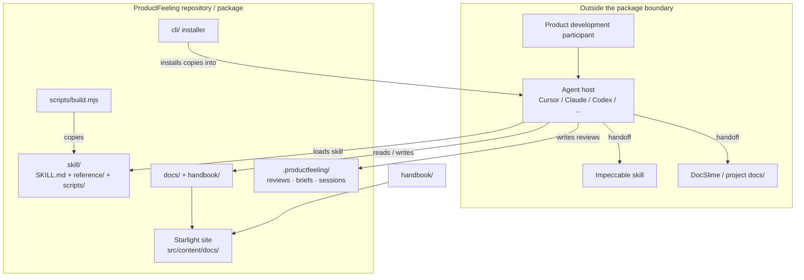

# Architecture

ProductFeeling is an **installable AI agent skill package**, not a hosted app. Source lives in `skill/` (router markdown, command references, small Node helper scripts). A build copies that source into provider skill directories and `dist/`. A thin CLI installs into consumer harnesses. A Starlight site documents the product; `docs/` (DocSlime) and `handbook/` are durable content sources. Runtime intelligence runs inside the user’s agent host — ProductFeeling supplies instructions and context discovery, not a server.

## Context diagram

**Inside boundary:** skill source, build, CLI, docs/handbook content, site staging, `.productfeeling/` conventions.  
**Outside:** agent hosts, consumer repos, Impeccable, DocSlime tooling, GitHub distribution.

## Components

| Component | Responsibility | Depends on |
|---|---|---|
| `skill/SKILL.md` | Command router, setup, principles, output conventions | `reference/`, `scripts/context.mjs` |
| `skill/reference/*.md` | Per-command flows and principles/catalog | Handbook chunks (selective), project docs |
| `skill/scripts/context.mjs` | Discover `docs/` + optional legacy FEELING.md; list available context | Consumer project filesystem |
| `skill/scripts/pin.mjs` | Pin/unpin host shortcuts for commands | Host skill layout |
| `scripts/build.mjs` | Copy `skill/` → provider dirs + `dist/` | `skill/` |
| `cli/` | Install/update skill into detected harness dirs | `build.mjs`, local or GitHub package |
| `docs/` | Durable product/strategy/experience/engineering SoT | DocSlime conventions |
| `handbook/` | Modular feeling handbook for selective agent load | Staged by `docs:prepare` |
| `scripts/prepare-docs-site.mjs` | Stage `docs/` + handbook into Starlight content | Astro/Starlight |
| `.productfeeling/` | Reviews, sessions, briefs, config — not product SoT | Consumer or this repo |
| Provider copies (`.cursor/`, `.claude/`, …) | Built install targets (Impeccable-parity style) | Build output from `skill/` |

## Data model

Stateless at runtime (no ProductFeeling backend). Durable artifacts are files:

| Artifact | Location | Role |
|---|---|---|
| Product / strategy / experience docs | `docs/**` | Feeling + product SoT when present |
| Requirements / architecture | `docs/REQUIREMENTS.md`, `docs/engineering/**` | Build contract and design |
| Handbook pages | `handbook/**` | Educational depth (selective load) |
| Review / brief / session | `.productfeeling/{reviews,briefs,sessions}/` | Ephemeral skill outputs |
| Legacy feeling file | `FEELING.md` (optional) | Backward-compatible context |
| Config | `.productfeeling/config.json` | Skill project metadata |

## Domain language and boundaries

| Domain concept | Meaning in this project | Boundary / owner |
|---|---|---|
| Feeling context | Intentional emotional north star and anti-goals for a product | Prefer `docs/`; optional legacy FEELING.md |
| Command | Argument-routed `/productfeeling` technique or setup flow | `skill/reference/<command>.md` |
| Review artifact | Persisted evaluation output | `.productfeeling/reviews/` only |
| Handbook chunk | One modular markdown unit of depth | `handbook/`; never full-book default |
| Companion | Impeccable (craft) or DocSlime (docs) | Outside this package; handoff only |
| Provider copy | Built skill tree for a host | Generated; edit `skill/` only |

## Key flows

### Install and load skill

1. Maintainer or consumer runs CLI / `npx skills add` / provider install — **cli** or host tooling.
2. **build** (or packaged `dist`) places skill files in host skill dirs.
3. Human invokes `/productfeeling …` — **host** loads **SKILL.md**.

### Context-aware command (project-anchored)

1. Agent runs **context.mjs** once per session — discovers `docs/` (strategy/experience priority) and optional FEELING.md.
2. Agent loads **reference/\<command\>.md** and **principles.md**.
3. Agent reads only needed docs/handbook slices + target surface — evaluates against grounded clarity / project north star.
4. Findings return in chat; optional write to **`.productfeeling/reviews/`**; durable writes to **`docs/`** only when requested.

### Chat-only review

1. Human pastes surface/flow — no project docs required.
2. Same command flow; context script may report `NO_PROJECT_DOCS` — review still proceeds (FR-4, FR-12).

### Docs site

1. Author edits `docs/` or `handbook/`.
2. **prepare-docs-site** stages into `src/content/docs/`.
3. Astro/Starlight serves the guide + staged developer/handbook pages.

## Cross-cutting concerns

- **Error handling:** Helper scripts fail soft where possible (e.g. missing context → advisory message, exit 0 for “no docs”); build/CLI use Node errors for real failures.
- **Configuration:** `.productfeeling/config.json`; `PRODUCTFEELING_CONTEXT_DIR` override for legacy feeling path; Node `>=22.12.0` for repo scripts.
- **Security:** No ProductFeeling network service; skill runs with host tool permissions; refuse dark-pattern prescription in principles (product constraint, not auth).
- **Performance / tokens:** Selective load of docs and handbook (NFR-2); context script lists paths rather than dumping all file bodies.
- **Observability:** No production telemetry in-package yet — see OBSERVABILITY.md when filled.
- **Accessibility:** Feeling guidance must not override a11y (DESIGN.md / NFR-1).

## Decisions

- [ADR-0001 — Docs-first feeling context](adrs/0001-docs-first-feeling-context.md)
- [ADR-0002 — Skill source copied to provider directories](adrs/0002-skill-source-provider-copies.md)

## Risks & trade-offs

- **Host drift** — Install matrix must track Impeccable; providers can diverge (mitigation: parity requirement FR-11, shared build list).
- **Docs vs legacy FEELING.md** — Dual-read period can confuse agents (mitigation: prefer docs on conflict; fold legacy via handoff).
- **Agent non-determinism** — Behavior depends on host model following SKILL.md (mitigation: explicit setup steps, reference flows, principles).
- **Handbook bloat risk** — Large handbook can tempt full loads (mitigation: modular files + NFR-2; skill instructions forbid default full-book ingest).
- **No runtime metrics yet** — Outcome learning is qualitative/dogfood until observability is defined.
