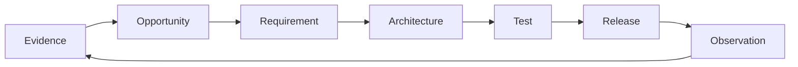

# Experience

Continuous discovery and experience design for **ProductFeeling**. Primary users are **typical product development participants** — technical and non-technical — using the skill in agent harnesses. Agents and DocSlime/`docs/` are part of the medium and persistence model, not a separate primary persona here.

## Discovery practice

Early-stage / dogfood-led for now:

| Practice | How we use it |
|---|---|
| **Sources** | Dogfooding this repo’s own `docs/strategy` + `docs/experience`; companion skill patterns (Impeccable, DocSlime); qualitative feedback from participants when available |
| **Recording** | Opportunities and journeys as focused files in this folder; strategic bets in `../strategy/`; stable behavior in `../REQUIREMENTS.md` |
| **Threshold** | A finding becomes a requirement when it is durable, testable, and repeated across sessions — not from a single vibe |
| **Not yet** | Formal interview cadence, support queue, or product analytics — do not invent those here |

When evidence arrives, add a study file and link it from the Index; fold validated behavior into REQUIREMENTS.

## Experience principles

Cross-cutting qualities for every participant journey (see also [`../DESIGN.md`](../DESIGN.md)):

- **Feeling is a requirement** — name it; don’t wave “it feels off” away.
- **Low setup tax** — chat-only works; missing docs never blocks a scoped review.
- **One primary feeling** — clarity over emotional kitchen-sink.
- **Docs-first persistence** — lasting truth in `docs/` (strategy/experience); reviews in `.productfeeling/reviews/`.
- **Seamless ethics** — refuse coercion; flag risks as normal design findings, never as ethics police.
- **Clean handoff** — Impeccable for craft, DocSlime for durable narrative.
- **Accessibility wins** — feeling never overrides clarity, contrast, or reduced motion.
- **Token thrift** — selective docs and handbook loads.

## Artifact template

Use this shape for new opportunity, journey, study, or product-slice files. Omit empty sections.

```markdown
# Opportunity or experience

## Observed need and evidence
## Desired user and business outcome
## Users and context
## Current journey
## Opportunity and hypothesis
## Intended behavior
## Given / When / Then scenarios
## Constraints and domain language
## Success signals and telemetry
## Open questions
## Related requirements, tests, architecture, and ADRs
```

## Traceability



## Index

| Document | Kind | Status | What it informs |
|---|---|---|---|
| [feeling-north-star.md](./feeling-north-star.md) | Product slice | Active | Primary feeling: grounded clarity (→ confidence) |
| [journey-product-development-participant.md](./journey-product-development-participant.md) | Journey | Active (intended) | FR-2–4, FR-6–10, FR-12; primary technical + non-technical paths |
