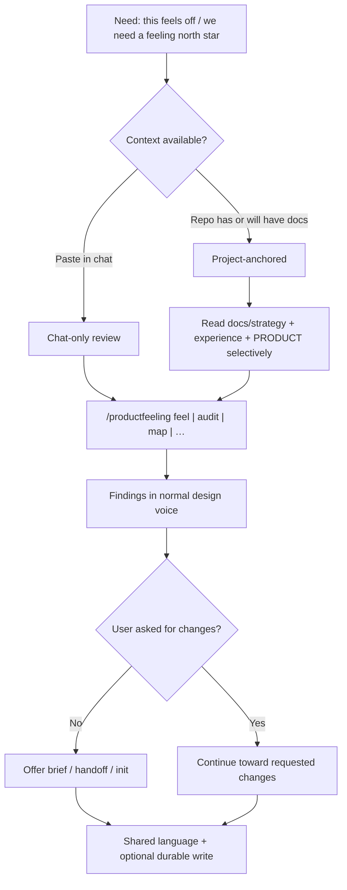

# Journey: product development participant

**Kind:** Journey (primary)  
**Status:** Active — intended experience (not yet externally validated)  
**Users:** Typical product development participants — technical (engineers, technical PMs) and non-technical (designers, PMs, product leads) working in agent harnesses.

## Observed need and evidence

**Need (from product strategy, not field study):** Agents are strong at layout and weak at intentional affect. Participants lack a shared language for “how this should feel,” then either skip feeling work or debate it again during polish.

**Evidence status:** Working hypothesis grounded in [`../PRODUCT.md`](../PRODUCT.md) and [`../strategy/market-and-users.md`](../strategy/market-and-users.md). No interview quotes or analytics recorded here yet.

## Desired user and business outcome

**Primary feeling (ProductFeeling as product):** grounded clarity — participants can name how their product feels and why, on real evidence; confidence to act is the earned residue.

**Never feel:** blocked or overwhelmed (see [feeling-north-star.md](./feeling-north-star.md)).

- Participant can name a primary feeling and anti-goals without inventing a parallel process.
- They can review a surface/flow/state for emotional fit before or beside craft work.
- They leave with an executable brief or a durable docs update — not a vibes-only chat.
- ProductFeeling is used as a companion to Impeccable and DocSlime, not a replacement.

## Users and context

| Lens | Context | Friction to reduce |
|---|---|---|
| **Non-technical** (PM, designer, product lead) | Decides outcomes; may paste Figma/copy/flows; may not own the repo | Jargon, ceremony, “ethics police,” blocked because docs aren’t set up |
| **Technical** (engineer, technical PM) | Owns code/docs; pairs with Impeccable; may run init and handoff | Re-litigating strategy in craft; duplicate SoT; token-heavy handbook loads |

Both may use **chat-only** (paste a surface) or **project-anchored** (`docs/` + optional `.productfeeling/`).

## Current journey (intended)

### Stages and intended feeling

| Stage | What happens | Intended feeling |
|---|---|---|
| Arrive | Install skill or invoke in harness; optional handbook chunk | Ready, on solid footing |
| Orient | Context from chat and/or `docs/` (strategy/experience first for this product) | Grounded — oriented, low setup tax |
| Review | Named techniques against one primary feeling | Grounded clarity — evidence, not vibes |
| Decide | Findings; ethics as ordinary design judgment | Clarity — named, actionable, not policed |
| Continue | Brief → Impeccable, and/or durable update → DocSlime/`docs/` | Confidence — obvious next move |
| Persist | Reviews in `.productfeeling/reviews/` only; docs only when lasting | Confidence — uncluttered, respected |

## Opportunity and hypothesis

**Opportunity:** Make feeling work a first-class, low-friction step for *both* technical and non-technical participants in the same skill UX.

**Hypothesis:** If chat-only never blocks on missing docs, and project-anchored work prefers existing `docs/` (especially strategy/experience) over a conspicuous emotion file, then both participant types will complete a useful review in one session and optionally persist without creating competing sources of truth.

## Intended behavior

- Missing `docs/` / FEELING.md never blocks a scoped review of provided material.
- One primary feeling; secondary tones at most two.
- Selective handbook and docs loads.
- Dark-pattern invention refused; existing risks flagged as design findings.
- Handoff offered; docs not auto-bloated with reviews.

## Given / When / Then scenarios

| ID | Scenario |
|---|---|
| EXP-J1 | **Given** a non-technical PM pastes a checkout flow and asks how it feels, **When** they run `/productfeeling feel`, **Then** they get a primary-feeling restatement and findings without being forced through init. |
| EXP-J2 | **Given** an engineer in a DocSlime repo, **When** they run a review, **Then** the agent loads relevant `docs/strategy` / `experience` / PRODUCT slices and writes the review under `.productfeeling/reviews/`. |
| EXP-J3 | **Given** either participant asked only for review, **When** the command finishes, **Then** the agent does not apply unsolicited product/code edits (may offer handoff). |
| EXP-J4 | **Given** either participant asked to fix empty-state feeling, **When** analysis finishes, **Then** work continues toward that change, with Impeccable offered for craft polish. |

Maps to [`../REQUIREMENTS.md`](../REQUIREMENTS.md): FR-2, FR-3, FR-4, FR-6, FR-8, FR-9, FR-10, FR-12.

## Constraints and domain language

- **Feeling context** — product/strategy/experience docs (preferred); legacy FEELING.md optional.
- **Participant** — human in the product development lifecycle (technical or not).
- **Agent** — harness executing the skill; not the primary “user” of this journey doc, but the medium.
- Companions: Impeccable (craft), DocSlime (durable docs).

## Success signals and telemetry

Qualitative for now (no production telemetry contract yet):

- Participant can restate the primary feeling after one session.
- Review completes without setup deadlock.
- Durable writes land in `docs/` only when lasting; reviews stay in `.productfeeling/`.

## Open questions

- Field evidence: which participant type hits chat-only vs project-anchored first?
- What “time to first useful finding” feels acceptable for each lens?
- How often should handbook depth be offered vs stayed silent?

## Related requirements, tests, architecture, and ADRs

- Requirements: FR-2–FR-4, FR-6–FR-10, FR-12
- Strategy: [`../strategy/market-and-users.md`](../strategy/market-and-users.md), [`../strategy/positioning.md`](../strategy/positioning.md)
- Tests / observability: TBD when engineering docs are filled
