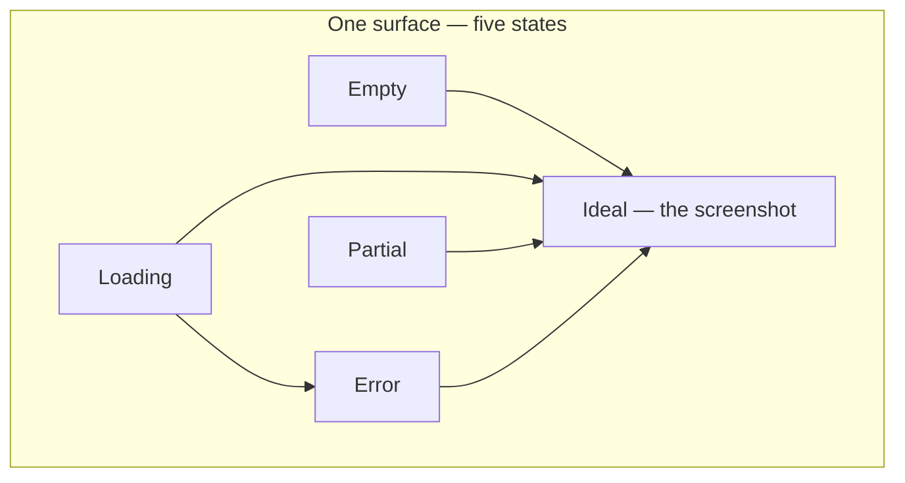
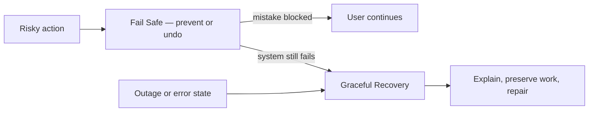

# Surfaces, Flows, and States

The units of product-design work. When this handbook (or a ProductFeeling agent command) says "audit this surface" or "review this flow," these are the definitions in play.

## Definition

- A **surface** is anything a user encounters and reads meaning from: a screen, a component, a modal, an empty list, an error toast, a push notification, an email, a CLI message, a loading spinner. If the user can see it and form a feeling about it, it is a surface.
- A **flow** is an ordered sequence of surfaces through which a user pursues one job: signup, first export, checkout, cancellation. Flows have entrances (where intent arrives from), exits (success, abandonment, error), and a feeling trajectory—not just a conversion rate.
- A **state** is one of the conditions a single surface can be in. Every surface has at least five: **ideal** (the screenshot state), **empty** (nothing to show yet), **loading** (waiting on the system), **partial** (some data, awkward amounts), and **error** (something failed). This is Scott Hurff's "UI stack," and it is the most engineer-actionable idea in product design.
- A **moment** is a point in a flow with outsized emotional weight: first value, a permission ask, a payment, a failure, a goodbye. Moments are where the [Peak–End Rule](07-peak-end-rule.md) concentrates its effect.

## Why it matters

Design tools and code reviews both default to the ideal state, but users spend most of their emotional life in the other four:

A new user meets the empty state before the ideal one; a user on a slow connection meets loading; a user with three items instead of thirty meets partial; every user eventually meets error. Products feel broken not because the ideal state is wrong but because the non-ideal states were never designed—they were left to whatever the framework renders when data is missing.

## Deep dive

The five states are not equal in emotional stakes:

- **Empty** is a first impression and a fork: it either teaches the next step or communicates "nothing for you here" ([Empty States](../ttps/empty-states.md)).
- **Loading** is a promise about time; unexplained waits read as failure long before they time out ([Loading Feedback](../ttps/loading-feedback.md), [Perceived Effort Delay](../ttps/perceived-effort-delay.md)).
- **Partial** is where layouts break and comparisons embarrass ("you have 1 friends"). It is the state real usage lives in longest.
- **Error** is a trust event, not an edge case ([Graceful Recovery](../ttps/graceful-recovery.md)).
- **Ideal** earns its polish only when the other four hold ([Aesthetic–Usability Effect](08-aesthetic-usability-effect.md)).

Flows add a second dimension: state transitions across surfaces. The feeling of a flow is dominated by its worst transition—an unexplained jump, a lost draft between steps, a back button that discards work. Mapping a flow means mapping intent at entry, state at each surface, and what each exit (including abandonment) leaves the user with—including [Graceful Exit](../ttps/graceful-exit.md) at the largest scale.

### The wait triad (do not collapse these)

Three TTPs handle acknowledgement of change and waiting. Agents reviewing PRs should classify before applying a card:

| Signal | TTP | Meaning |
|--------|-----|---------|
| State *changed* | [Micro Interactions](../ttps/micro-interactions.md) | The action registered; cause and effect are clear |
| Work *pending* | [Loading Feedback](../ttps/loading-feedback.md) | The system is working; wait is honest and proportionate |
| Work is *staged* | [Perceived Effort Delay](../ttps/perceived-effort-delay.md) | Real work is shown as it happens—never fake delay to look busy |

### Prevention vs recovery

[Fail Safe](../ttps/fail-safe.md) prevents costly mistakes *before* they land (confirmations, undo, safe defaults). [Graceful Recovery](../ttps/graceful-recovery.md) is what happens *after* failure is real (honest errors, preserved work, repair). Do not rewrite Fail Safe as a recovery card, or Recovery as another confirmation dialog.

### Partial state

There is no dedicated TTP for partial data—treat it as a first-class design problem under Empty States + layout QA: pluralisation, sparse tables, and “awkward counts” that make the product feel broken even when the API succeeded.

## For engineers and agents

- Every component you ship has all five states whether or not anyone designed them. Before merging UI code, ask: what renders when the array is empty, the promise is pending, the request 500s, and the data is one item instead of fifty?
- States are enumerable, which makes them testable: Storybook stories, fixture data, and snapshot tests per state turn "design review" into a checklist. An agent auditing a surface should enumerate the five states and report which are unhandled.
- Flow review is a state-machine review: draw the surfaces as nodes and the user's transitions as edges, then check every edge for preserved work, preserved context, and an honest exit. Dead ends (states with no forward edge) are bugs even when no exception is thrown.
- Loading and error states are usually decided in the data layer (timeouts, retries, optimistic updates, cache staleness), not in the view. If the API contract has no story for "slow" and "failed," the surface cannot have one either.

## Where it shows up

- Per-state TTPs: [Empty States](../ttps/empty-states.md), [Loading Feedback](../ttps/loading-feedback.md), [Graceful Recovery](../ttps/graceful-recovery.md), [Fail Safe](../ttps/fail-safe.md), [Micro Interactions](../ttps/micro-interactions.md), [Perceived Effort Delay](../ttps/perceived-effort-delay.md)
- Flow TTPs: [Time to Value](../ttps/time-to-value.md), [Deep-link](../ttps/deep-link.md), [Graceful Exit](../ttps/graceful-exit.md)
- Strategies: [Onboarding](../strategies/01-onboarding.md), [Activation](../strategies/02-activation.md), [Conversion Optimisation](../strategies/07-conversion-optimisation.md)
- Arrival context: [Need States and Awareness](../discovery/02-need-states.md); trust of claims: [Calibrated Trust](11-calibrated-trust.md); cost of steps: [Friction](04-friction.md)

## Further reading

- [Why your user interface is awkward: the UI stack (Scott Hurff)](https://www.scotthurff.com/posts/why-your-user-interface-is-awkward-youre-ignoring-the-ui-stack/) — The five-states model this page is built on.
- [Designing Products People Love (Scott Hurff)](https://www.oreilly.com/library/view/designing-products-people/9781491923672/) — The UI stack in book form, with process.
- [Error-Message Guidelines (Nielsen Norman Group)](https://www.nngroup.com/articles/error-message-guidelines/) — The error state, held to a rigorous standard.
