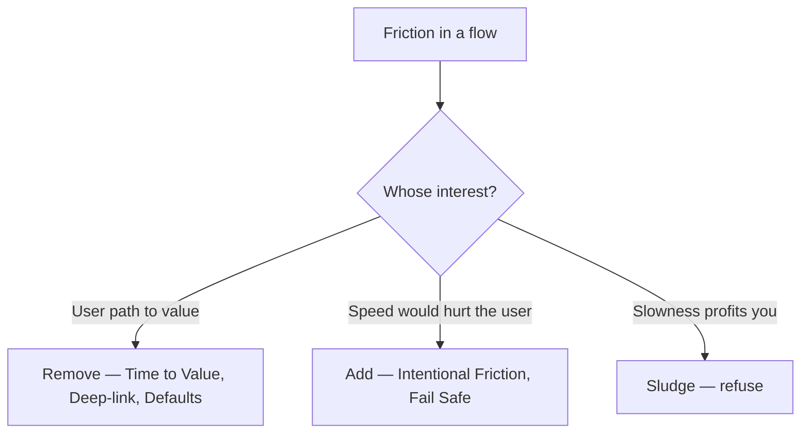

# Friction

Everything a user must spend—taps, waits, reading, thinking, deciding, trusting—between forming an intent and completing it. Friction is a budget, and every surface spends it.

## Definition

Product-design friction is **interaction cost** (the Nielsen Norman Group's term): the sum of physical effort (clicks, typing, scrolling, device switches) and mental effort (reading, remembering, choosing, translating jargon, managing doubt) required to reach a goal. Friction is not an aesthetic property; it is measurable work. Latency is friction. A confusing label is friction. A form field is friction. An unexpected permission dialog is friction plus suspicion.

The inverse concept matters equally: **sludge** (Thaler) is friction deployed *against* the user's interest—easy to subscribe, hard to cancel; one click to consent, seven screens to decline.

## Why it matters

Friction is where feelings and funnels meet. Users experience accumulated cost as emotion—impatience, self-doubt ("am I doing this wrong?"), and finally the quiet decision not to bother. Because [Fogg's B=MAP](10-habit-formation.md) puts ability alongside motivation, removing friction is usually cheaper than adding motivation: you cannot easily make someone want the outcome more, but you can almost always make it smaller, faster, or clearer to reach.

But friction is not uniformly bad, and "frictionless" is not the goal. Friction placed deliberately at the right moment protects users from irreversible mistakes, gives weight to meaningful choices, and makes effort feel earned. The craft is *allocation*: near zero on the path to first value, deliberate and legible at points of risk.

## Deep dive

A working taxonomy:

- **Mechanical friction** — steps, fields, taps, redirects. Audit by counting: how many actions from intent to outcome? ([Time to Value](../ttps/time-to-value.md), [Deep-link](../ttps/deep-link.md) attack this.)
- **Cognitive friction** — reading load, choice overload, unfamiliar patterns, jargon. Often invisible in analytics because it shows up as hesitation, not drop-off. ([Pattern Alignment](../ttps/pattern-alignment.md), [Progressive Disclosure](../ttps/progressive-disclosure.md), [JTBD Copywriting](../ttps/jtbd-copywriting.md).)
- **Temporal friction** — waits, spinners, cold starts, background jobs. Perceived duration matters more than measured duration; an explained wait feels half as long. ([Loading Feedback](../ttps/loading-feedback.md), [Perceived Effort Delay](../ttps/perceived-effort-delay.md).)
- **Emotional friction** — doubt, fear of commitment, fear of looking stupid, distrust of an ask. The most underdiagnosed kind: no event fires when a user hovers over "Connect bank account" and decides not to. ([Sandbox Experience](../ttps/sandbox-experience.md), [Permission Serve](../ttps/permission-serve.md), [Fail Safe](../ttps/fail-safe.md).)
- **Protective friction** — friction *on purpose*: confirmations before destruction, cooling-off pauses, typed acknowledgements. Good protective friction clarifies the choice; bad protective friction just slows everyone until they click through blind. ([Intentional Friction](../ttps/intentional-friction.md).)

The allocation rule this handbook keeps returning to:

**Remove friction from the user's path to value; add friction only where speed would hurt the user—never where slowness profits you.** The second clause is the line between Intentional Friction and sludge ([User Agency](12-user-agency.md)).

## For engineers and agents

- Performance work is emotion work. Cold-start time, time-to-interactive, and p95 latency on the first-value path are feeling metrics wearing engineering clothes; budget them like you budget error rates.
- Count round-trips, not just clicks: every redirect, OAuth hop, email-verification detour, and app switch is a place where intent leaks. Instrument abandonment *between* steps, not only at steps.
- Hesitation is measurable: time-on-field, field re-edits, back-and-forth navigation, hover-without-click on scary buttons. These proxies catch cognitive and emotional friction that completion rates miss.
- Defaults are friction decisions: a sensible default removes a decision; a missing default forces one; a self-serving default is sludge ([Setup Defaults](../ttps/setup-defaults.md)).
- When asked to "reduce friction" in a flow, check direction first: friction on the user's path to value should be removed; friction that protects the user from irreversible harm should be kept and made legible. Deleting a destructive-action confirmation reduces friction and is still wrong.

## Where it shows up

- Strategies: [Onboarding](../strategies/01-onboarding.md), [Activation](../strategies/02-activation.md), [Conversion Optimisation](../strategies/07-conversion-optimisation.md), [Trust Building](../strategies/09-trust-building.md), [Monetisation](../strategies/06-monetisation.md)
- Protective vs remove: [Intentional Friction](../ttps/intentional-friction.md); sludge refusal: [Graceful Exit](../ttps/graceful-exit.md); path shortening: [Time to Value](../ttps/time-to-value.md), [Deep-link](../ttps/deep-link.md), [Setup Defaults](../ttps/setup-defaults.md), [Momentum Bias](../ttps/momentum-bias.md)
- Temporal: [Loading Feedback](../ttps/loading-feedback.md), [Perceived Effort Delay](../ttps/perceived-effort-delay.md); cognitive: [Pattern Alignment](../ttps/pattern-alignment.md), [Progressive Disclosure](../ttps/progressive-disclosure.md), [JTBD Copywriting](../ttps/jtbd-copywriting.md)
- Concepts: [Surfaces, Flows, and States](03-surfaces-flows-states.md), [Mental Models](05-mental-models.md), [User Agency](12-user-agency.md); Discovery: [Need States](../discovery/02-need-states.md), [Talk, Search, and Buy](../discovery/04-how-customers-talk-search-buy.md)

## Further reading

- [Interaction Cost (Nielsen Norman Group)](https://www.nngroup.com/articles/interaction-cost-definition/) — The formal definition: physical plus mental effort to reach a goal.
- [Minimize Cognitive Load (NN/g)](https://www.nngroup.com/articles/minimize-cognitive-load/) — The mental half of the budget, with tactics.
- [FTC: Bringing Dark Patterns to Light](https://www.ftc.gov/reports/bringing-dark-patterns-light) — Sludge documented at regulatory scale, including cancellation obstruction.
