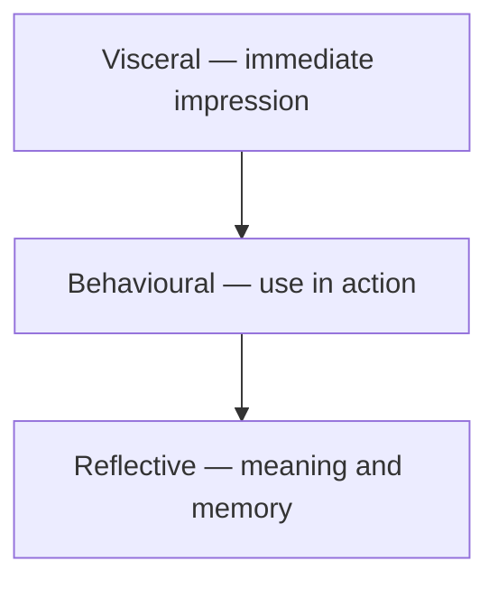

# Emotional Design

Don Norman's three-level model of how products produce feeling: visceral (immediate impression), behavioural (use in action), and reflective (meaning and memory afterwards).

## Definition

Emotional design is the practice of treating the feelings a product evokes as designed outcomes, not side effects. Norman's *Emotional Design* (2004) gave the field its working frame: every product is experienced simultaneously at three levels:

- **Visceral** — the split-second aesthetic and sensory read
- **Behavioural** — how it feels to operate: feedback, control, competence
- **Reflective** — the story users tell about it, and about themselves for using it

## Why it matters

The three levels fail independently, and fixing the wrong one wastes a cycle. A beautiful app that fumbles feedback fails behaviourally no matter how good the visuals are; a powerful tool that makes users feel vaguely embarrassed to recommend fails reflectively even with flawless usability. Diagnosing *which level* a feeling problem lives at is the first step of any emotion-aware review—and it is why "make it delightful" is not an actionable brief.

## Deep dive

**Visceral** is fast, automatic, and appearance-driven. It sets the prior for everything that follows—the [Aesthetic–Usability Effect](08-aesthetic-usability-effect.md) is the measurable version of this level. Visceral wins are cheap but shallow: they buy patience, not loyalty.

**Behavioural** is where most of this handbook's TTPs operate. Feelings of competence, control, and momentum come from tight feedback loops ([Micro Interactions](../ttps/micro-interactions.md)), honest waits ([Loading Feedback](../ttps/loading-feedback.md)), recoverable mistakes ([Fail Safe](../ttps/fail-safe.md), [Graceful Recovery](../ttps/graceful-recovery.md)), and progress that is visible and owned ([Gamified Progress](../ttps/gamified-progress.md)). Behavioural emotion is earned in use, which is why it cannot be added at the end.

**Reflective** is slow, conscious, and identity-adjacent: *this product respects me; I am the kind of person who uses this*. It is built from accumulated peaks and endings ([Peak–End Rule](07-peak-end-rule.md)), from the product's character ([Product Voice](../ttps/product-voice.md), [Small Quirk](../ttps/small-quirk.md)), and—strongly—from how the product behaves when the user is vulnerable: errors, bills, goodbyes ([Graceful Exit](../ttps/graceful-exit.md)). Reflective feeling is what people repeat to friends, which is why it drives referral more than any share button.

Norman's underlying point is often missed: affect is *functional*. Positive affect broadens thinking and increases tolerance for minor friction; anxiety narrows attention and makes the same interface objectively harder to use. "Attractive things work better" is not a slogan—it is a claim about cognition under emotional load.

## For engineers and agents

- The three levels map roughly onto layers of the stack: visceral lives in the theme and rendering quality (typography, spacing, motion, jank); behavioural lives in interaction logic and state handling (feedback, latency, error paths, undo); reflective lives in copy, lifecycle messaging, and what the product lets users show others.
- Triage "feels off" reports by level before writing code. Visceral complaints need design tokens and polish; behavioural complaints need state machines, feedback, and performance; reflective complaints need voice, narrative, and lifecycle work. Fixing the wrong layer burns a sprint and changes nothing.
- Behavioural emotion is mostly engineering: perceived responsiveness, preserved work, honest system status. A 200ms interaction with clear feedback outperforms a 50ms one that gives no acknowledgement—instrument perceived states, not just server timings.
- Reflective feeling accumulates in places engineers own but rarely design: release notes, transactional emails, data-export formats, the tone of a 404. These ship without design review by default; put them on the checklist.
- An agent auditing a surface should report findings tagged by level ("behavioural: no feedback on save; reflective: error copy blames the user"), because the tag determines who fixes it and how.

## Where it shows up

- History: [Why it Works](../why-it-works.md). Measurable craft: [Aesthetic–Usability Effect](08-aesthetic-usability-effect.md). Memory: [Peak–End Rule](07-peak-end-rule.md).
- Strategies: [Experience Refinement](../strategies/08-experience-refinement.md) (behavioural), [Premium Positioning](../strategies/12-premium-positioning.md) (visceral/reflective), [Trust Building](../strategies/09-trust-building.md), [Growth & Viral](../strategies/05-growth-viral.md) (reflective → recommend)
- TTPs: [Micro Interactions](../ttps/micro-interactions.md), [Loading Feedback](../ttps/loading-feedback.md), [Fail Safe](../ttps/fail-safe.md), [Graceful Recovery](../ttps/graceful-recovery.md), [Gamified Progress](../ttps/gamified-progress.md), [Product Voice](../ttps/product-voice.md), [Small Quirk](../ttps/small-quirk.md), [Graceful Exit](../ttps/graceful-exit.md), [Success Moments](../ttps/success-moments.md), [Shareability](../ttps/shareability.md) / [Referral](../ttps/referral.md) ([Social Transmission](14-social-transmission.md))
- Frame for naming the outcome: [Feeling North Star](01-feeling-north-star.md)

## Further reading

- [Emotional Design: People and Things (Don Norman)](https://jnd.org/emotional-design-people-and-things/) — The three-level model from its author.
- [Emotion & Design: Attractive things work better (Don Norman)](https://jnd.org/emotion-design-attractive-things-work-better/) — The functional-affect argument.
- [Affective Computing group (MIT Media Lab)](https://www.media.mit.edu/groups/affective-computing/overview/) — Picard's research lineage treating affect as a first-class signal.
- [Microinteractions (Dan Saffer)](https://www.oreilly.com/library/view/microinteractions/9781449342760/) — The behavioural level made concrete.
