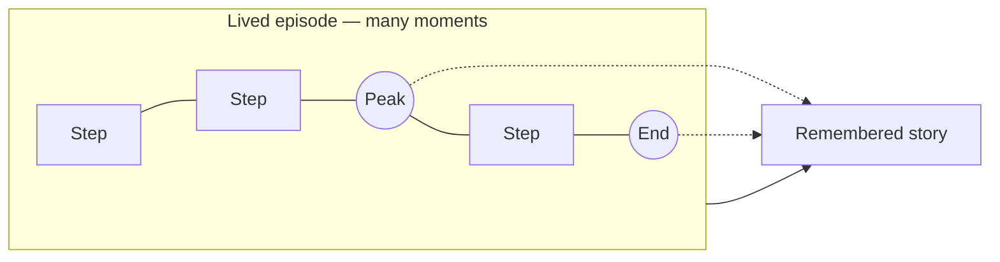

# Peak–End Rule

People remember an experience by its most intense moment and by how it ends—not by its average quality or duration.

## Definition

The peak–end rule (Kahneman, Fredrickson, and colleagues) is the finding that retrospective evaluation of an episode is disproportionately determined by two samples: the emotional **peak** (best or worst moment) and the **end**. Duration barely registers ("duration neglect").

The user who rates your product later is not replaying the session; they are recalling a compressed story built from its extremes and its finish.

## Why it matters

Funnels treat every step as equal; memory does not. A session with nine smooth steps and one moment of panic is remembered as panic. A cancellation flow is a few seconds of a multi-year relationship, yet it can dominate what the customer says about you forever, because it is both a potential negative peak *and* the ending. The rule tells you where designed feeling pays compound interest: peaks and endings first, averages later.

## Deep dive

Three practical consequences:

1. **Engineer the peaks you want.** First value, a finished project, a recovered mistake—these are candidate positive peaks. [Success Moments](../ttps/success-moments.md) exists to mark them so they register; [Time to Value](../ttps/time-to-value.md) pulls the first peak earlier.
2. **Defuse the negative peaks you already have.** Errors, scary waits, and payment failures are your current peaks whether you designed them or not—negativity bias makes them count double. [Graceful Recovery](../ttps/graceful-recovery.md), [Loading Feedback](../ttps/loading-feedback.md), and [Fail Safe](../ttps/fail-safe.md) are peak-defusal tools.
3. **Design endings on purpose.** Every scale of the product has an ending: the end of a task, a session, a subscription. Most products lavish design on beginnings and let endings happen by accident. [Graceful Exit](../ttps/graceful-exit.md) applies the rule at the largest scale: the final impression is the one that decides whether a churned user returns or warns others away.

One caution: the rule describes *memory*, not *ethics*. Using a manufactured emotional spike to paper over a genuinely poor experience is manipulation, and users eventually reconcile the story with reality. The honest application is to make real value memorable and real failures survivable—not to fake peaks.

## For engineers and agents

- Peaks are enumerable in code: the first-success event, every user-visible error path, payment results, and final screens of flows. Grep for them—throw sites that surface to the UI, catch blocks that render fallbacks, terminal states of multi-step forms—and you have the list of moments that will dominate user memory.
- Allocate code-review rigour by emotional stakes, not code size. A two-line change to an error message or a cancellation screen deserves more scrutiny than two hundred lines of internal refactor, because it edits a probable peak or ending.
- Endings are states you already have: the last screen of every flow, session end, subscription end. Check each terminal state for what it leaves behind—confirmed work, a clear next step, or a shrug. A flow that simply stops rendering has an ending; it's just an accidental one.
- Instrument peaks directly: error-path telemetry with user-visible outcome ("saw fallback, retried, succeeded" vs. "saw fallback, left"), time-to-first-success for new users, and completion screens reached. Session-average satisfaction hides exactly what the rule says matters.
- For agents: when summarising a flow audit, order findings by peak/end proximity—an issue on the first-value moment or the final screen outranks the same issue mid-flow.

## Where it shows up

- Peak/end TTPs: [Graceful Recovery](../ttps/graceful-recovery.md), [Graceful Exit](../ttps/graceful-exit.md), [Success Moments](../ttps/success-moments.md), [Time to Value](../ttps/time-to-value.md), [Loading Feedback](../ttps/loading-feedback.md), [Fail Safe](../ttps/fail-safe.md), [The Paywall](../ttps/the-paywall.md), [Value Replay](../ttps/value-replay.md), [Shareability](../ttps/shareability.md)
- Strategies: [Onboarding](../strategies/01-onboarding.md), [Activation](../strategies/02-activation.md), [Retention](../strategies/03-retention.md), [Monetisation](../strategies/06-monetisation.md), [Trust Building](../strategies/09-trust-building.md), [Experience Refinement](../strategies/08-experience-refinement.md)
- Concepts: [Emotional Design](06-emotional-design.md) (reflective layer), [Feeling North Star](01-feeling-north-star.md), [Calibrated Trust](11-calibrated-trust.md), [User Agency](12-user-agency.md) (no manufactured peaks)
- History: [Why it Works](../why-it-works.md)

## Further reading

- [The Peak–End Rule (Nielsen Norman Group)](https://www.nngroup.com/articles/peak-end-rule/) — The finding applied to UX, with the classic studies.
- [When More Pain Is Preferred to Less (Kahneman et al., 1993)](https://doi.org/10.1111/j.1467-9280.1993.tb00589.x) — The original cold-pressor experiment demonstrating duration neglect.
- [Thinking, Fast and Slow (Daniel Kahneman)](https://en.wikipedia.org/wiki/Thinking,_Fast_and_Slow) — The remembering self vs. the experiencing self, in context.
