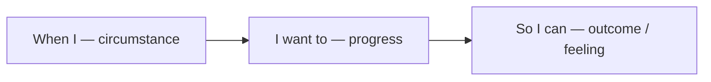

# Jobs-to-be-Done (JTBD)

People do not buy products; they hire them to make progress in a specific circumstance. The job—not the feature list—is the unit of value.

## Definition

Jobs-to-be-Done (Christensen, Ulwick, Moesta, and others) is a lens that defines a product by the progress a user is trying to make: the situation they are in, the outcome they want, and the anxieties and habits that push and pull them along the way. The canonical shorthand: nobody wants a quarter-inch drill; they want a quarter-inch hole—and behind the hole, a shelf, and behind the shelf, a tidier room.

## Why it matters

Emotion lives in the job, not the feature. A user "hiring" an expense app is not seeking optical character recognition; they are seeking relief from a nagging pile of receipts and the feeling of being on top of their finances. Copy, onboarding, and success states that speak to the job land emotionally; those that describe features ask the user to do the translation themselves—at the exact moments (first run, paywall, empty state) when their patience is thinnest.

JTBD also explains switching. Progress is blocked by more than missing features: habit ("I know my current tool") and anxiety ("what if migration loses my data?") hold people in place. Reducing those forces—an [Effort Moat](../ttps/effort-moat.md) honoured on the way in, a [Sandbox Experience](../ttps/sandbox-experience.md) that de-risks trial—often beats adding capability.

## Deep dive

Three components of a well-stated job:

1. **Circumstance:** *when I…* (context activates the job—see [Habit Formation](10-habit-formation.md) for why context is also what cues routines).
2. **Progress:** *…I want to…* (the change in the user's situation, stated in their words, not yours).
3. **Outcome:** *…so I can…* (the emotional and social payoff: feel prepared, look competent, stop worrying).

The "so I can" clause is where feeling enters, and it is the layer most feature-centric copy omits. It is also where the [Feeling North Star](01-feeling-north-star.md) of a surface usually hides: the outcome clause of the job *is* the feeling to design for.

Interviewing for jobs is unlike interviewing for preferences: you reconstruct the timeline of a real switch and mine the pushes, pulls, anxieties, and habits at each step:

What people did is evidence; what they predict they would do is noise.

## For engineers and agents

- Name analytics events after jobs, not implementation: `report_shared` tells you progress happened; `button_clicked_export_v2` tells you a DOM node fired. Job-named events survive redesigns and make funnels legible to everyone, including future agents.
- Define "activation" as a job outcome, not a feature interaction. "Created a project" is a setup step; "sent the first invoice" is progress. Instrumenting the wrong one makes every downstream metric confidently misleading.
- The job hierarchy is an API-design tool: users hire the hole, not the drill. When designing an endpoint, command, or screen, expose the progress ("publish this") and bury the mechanism (rendering, upload, CDN invalidation) unless the user must control it.
- Anxieties and habits are requirements: "what if migration corrupts my data" is addressed with dry-run modes, previews, and reversible imports—engineering features that exist purely to reduce a switching force ([Sandbox Experience](../ttps/sandbox-experience.md), [Fail Safe](../ttps/fail-safe.md)).
- For agents writing copy or reviewing flows: rewrite feature statements as job statements and see what breaks. If a screen's headline cannot be phrased as the user's progress ("Get paid faster", not "Invoice templates 2.0"), the screen probably doesn't know its job either.

## Where it shows up

- Discovery (reciprocal): [Ideal Customer and User Profiles](../discovery/01-ideal-customer-and-users.md), [Need States and Awareness](../discovery/02-need-states.md), [How Customers Work Today](../discovery/03-how-customers-work-today.md), [How Customers Talk, Search, and Buy](../discovery/04-how-customers-talk-search-buy.md)
- TTPs: [JTBD Copywriting](../ttps/jtbd-copywriting.md), [Intent Mirroring](../ttps/intent-mirroring.md), [Sandbox Experience](../ttps/sandbox-experience.md), [Effort Moat](../ttps/effort-moat.md), [Time to Value](../ttps/time-to-value.md), [The Paywall](../ttps/the-paywall.md), [Empty States](../ttps/empty-states.md), [Discovery](../ttps/discovery.md)
- Strategies: [Onboarding](../strategies/01-onboarding.md), [Activation](../strategies/02-activation.md), [Intent Shaping](../strategies/10-intent-shaping.md), [Conversion Optimisation](../strategies/07-conversion-optimisation.md), [Monetisation](../strategies/06-monetisation.md)
- Concepts: [Feeling North Star](01-feeling-north-star.md), [Habit Formation](10-habit-formation.md), [Investment and Continuity](13-investment-and-continuity.md)

## Further reading

- [Know Your Customers' "Jobs to Be Done" (Christensen et al., HBR)](https://hbr.org/2016/09/know-your-customers-jobs-to-be-done) — The canonical statement of the theory.
- [Jobs to Be Done (Jim Kalbach)](https://www.jtbdtoolkit.com/book) — A practitioner's toolkit for job mapping and interviews.
- [Demand-Side Sales 101 (Bob Moesta)](https://www.goodreads.com/book/show/55338968-demand-side-sales-101) — The forces of progress (push, pull, anxiety, habit) applied end to end.
