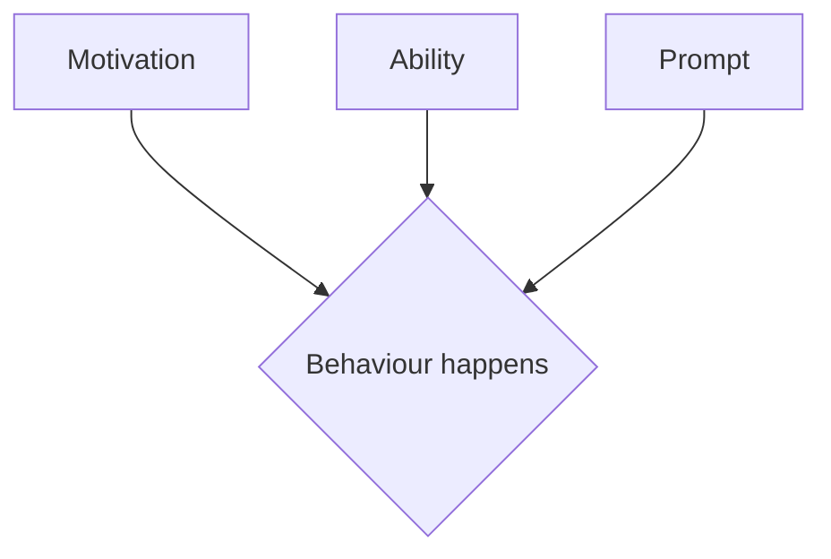
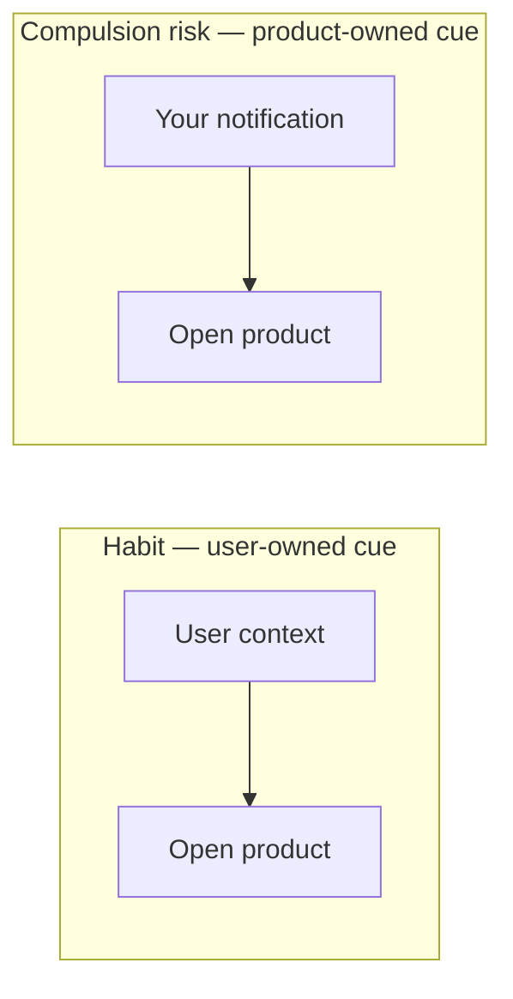

# Habit Formation

Habits are context-cued routines: a stable cue, a doable action, and a meaningful outcome, repeated until the context itself triggers the behaviour.

## Definition

A habit is behaviour that context initiates with little deliberation (Wood & Rünger, 2016). In product terms: the user returns not because a notification begged them to, but because a recurring situation—Monday planning, a receipt in hand, a free moment—has become mentally linked to the product as the natural response.

Fogg's B=MAP model gives the formation conditions—behaviour occurs when all three converge; ability (make it smaller) is usually the highest-leverage dial:

## Why it matters

Retention built on habit feels like fit; retention built on interruption feels like nagging. The distinction is who owns the cue:

When the cue is the user's own context, the product has earned a place in their life. When the cue is your push notification schedule, you are renting attention—and the rent compounds into resentment. This is the line between [Habit Formation](../strategies/11-habit-formation.md) as a strategy and the compulsion loops this handbook refuses.

## Deep dive

What the research actually says, against the folklore:

- **There is no "21 days."** Lally et al. (2010) measured automaticity forming over a median of ~66 days, with a range from 18 to 254. Habit strength grows asymptotically with repetition in a stable context; missing a single day barely dents the curve. Design implication: streaks that punish one miss are fighting the science, not using it ([Gamified Progress](../ttps/gamified-progress.md) is deliberate about this).
- **Context stability beats motivation.** Habits form fastest when cue and action recur in the same context. Products help by anchoring to existing routines ([System Widget](../ttps/system-widget.md) puts value where the user already looks; [Commitment](../ttps/commitment.md) lets users pick their own anchor) rather than inventing new ones.
- **Reward closes the loop, but reliability is the loop.** Variable novelty can decorate a dependable outcome; it must not replace it. A slot-machine core is compulsion, not habit—see [Variable Reward](../ttps/variable-reward.md) for the honest version.
- **Habits are use-neutral; goals are not.** The same mechanism builds a language-practice routine or a doomscrolling one. The ethical test is whether the user, on reflection, endorses the routine—which connects habit design directly to [User Agency](12-user-agency.md).

### Commitment and consistency

Voluntary, low-stakes declarations increase follow-through when the product then designs around what the user said—not when the pledge was extracted under pressure. That is the science behind [Commitment](../ttps/commitment.md), and it also informs [Intent Mirroring](../ttps/intent-mirroring.md), [Setup Defaults](../ttps/setup-defaults.md), and [Intent Shaping](../strategies/10-intent-shaping.md). Forced pledges and guilt streaks poison the same mechanism.

Boundary with progress UI: [Gamified Progress](../ttps/gamified-progress.md) makes deterministic competence visible; [Variable Reward](../ttps/variable-reward.md) adds optional novelty at the edge of a *reliable* core. If novelty *is* the core, you have left habit formation for compulsion.

Continuity of what users built—saved work, portability, re-entry—belongs under [Investment and Continuity](13-investment-and-continuity.md), not streak mechanics.

## For engineers and agents

- Cue ownership is an architecture decision. User-owned cues live in *their* context: home-screen widgets, calendar entries, OS share sheets, editor integrations—places your product appears when the user's situation summons it. Product-owned cues are your notification scheduler. Build the first kind before scaling the second.
- Encode the science in the mechanics: streak logic with grace days (a single miss barely dents real habit curves, so don't zero the counter), reminders anchored to user-declared moments ([Commitment](../ttps/commitment.md)) rather than engagement-optimal send times, and caps that respect the product's natural usage frequency.
- Notification systems need a refusal budget: track opt-out and mute rates per notification type as first-class metrics. A rising mute rate means you are burning the cue channel for everyone, including the messages users wanted.
- Distinguish habit metrics from compulsion metrics: repeat visits triggered by user context (direct opens, widget taps, deep-link returns) are habit signal; visits that only follow a push are rented attention. Segment DAU by entry point before celebrating it.
- For agents: when asked to "improve retention," check which side of the line the request lands on. Strengthening a reliable loop the user chose is habit work; engineering variable rewards or guilt into the return path is the compulsion pattern this handbook refuses.

## Where it shows up

- Strategy: [Habit Formation](../strategies/11-habit-formation.md); related [Retention](../strategies/03-retention.md), [Engagement](../strategies/04-engagement.md)
- TTPs: [Commitment](../ttps/commitment.md), [System Widget](../ttps/system-widget.md), [Value Replay](../ttps/value-replay.md), [Variable Reward](../ttps/variable-reward.md), [Gamified Progress](../ttps/gamified-progress.md), [Investment](../ttps/investment.md), [Effort Moat](../ttps/effort-moat.md)
- Discovery: [How Customers Work Today](../discovery/03-how-customers-work-today.md) (cadence), [Need States](../discovery/02-need-states.md)
- Concepts: [Friction](04-friction.md) (ability), [Jobs-to-be-Done](09-jobs-to-be-done.md), [User Agency](12-user-agency.md), [Investment and Continuity](13-investment-and-continuity.md)
- History: [Why it Works](../why-it-works.md)

## Further reading

- [Psychology of Habit (Wood & Rünger, 2016)](https://doi.org/10.1146/annurev-psych-122414-033417) — The definitive review of context-cued habit.
- [How are habits formed (Lally et al., 2010)](https://doi.org/10.1002/ejsp.674) — The real formation curve, and why single misses do not break it.
- [Fogg Behavior Model (Stanford Behavior Design Lab)](https://behaviordesign.stanford.edu/resources/fogg-behavior-model) — B=MAP: motivation, ability, prompt.
