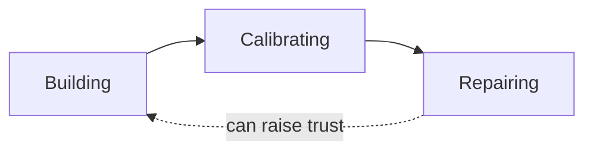
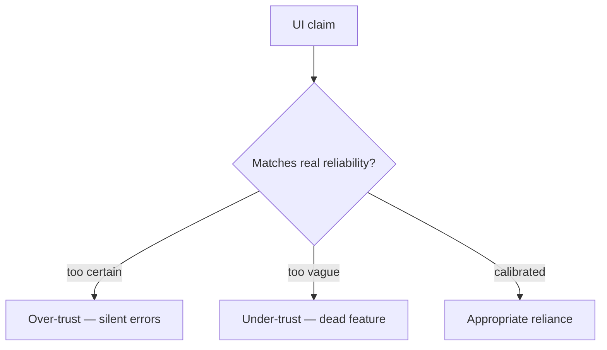

# Calibrated Trust

The goal is not maximum trust but *accurate* trust: users who rely on the product exactly as much as it deserves—and know when to check.

## Definition

Calibrated trust is a match between a user's confidence in a system and the system's actual reliability. Over-trust produces silent failures the user absorbs as their own mistakes; under-trust turns capable features into dead weight. The concept comes from automation research and is now central to artificial intelligence (AI) interaction design (Google's People + AI Guidebook, Microsoft's Human-AI Experience guidelines), but it applies to every product promise: sync that "just works," a backup that "completed," an estimate that "should be accurate."

## Why it matters

Trust is the emotional substrate of every other strategy—no onboarding, monetisation, or habit survives its collapse. And trust is asymmetric: it accrues slowly, through many kept promises, and collapses quickly, through one confident lie. A product that hedges honestly ("this may take a minute", "I'm not sure about this one") banks small deposits; a product that radiates certainty and is wrong makes a withdrawal it may never recover. Users calibrate on your worst confident error, not your average accuracy.

## Deep dive

Three movements of trust, each with its own design work:

1. **Building.** Trust grows from legibility and kept promises: honest waits ([Loading Feedback](../ttps/loading-feedback.md)), permissions asked when their benefit is obvious ([Permission Serve](../ttps/permission-serve.md)), safeguards where mistakes are expensive ([Fail Safe](../ttps/fail-safe.md)). The [Trust Building](../strategies/09-trust-building.md) strategy composes these.
2. **Calibrating.** Where the system is probabilistic—AI outputs, estimates, predictions—the interface must transmit *how much* to trust: hedged language matched to real performance, visible sources, review gates before consequential actions, and effortless correction. [Calibrated Confidence](../ttps/calibrated-confidence.md) is the dedicated TTP. The failure mode on each side has a name: **precision theatre** (displaying certainty the model cannot support) and **disclaimer wallpaper** (hedging everything until hedges mean nothing).
3. **Repairing.** Trust after failure follows apology research more than interface convention: acknowledge the impact, explain plainly, repair the damage (restore the work, refund the charge), and show what changed. An apology without repair is theatre; repair without acknowledgement is suspicious. [Graceful Recovery](../ttps/graceful-recovery.md) operationalises this—and a well-repaired failure can leave trust *higher* than before, because the user has now seen how you behave under stress.

The through-line: trust is evidence-based. Every claim your interface makes—a progress bar, a checkmark, a confidence label—is testimony, and the user is always, quietly, cross-examining.

## For engineers and agents

- Every UI element that reports state is an assertion, and assertions must be backed: a checkmark means the write was durably acknowledged, a progress bar means progress is actually being measured, "saved" means recoverable. Rendering success before the system reaches it is a trust bug, not a UX nicety.
- Optimistic UI needs a rollback story: if you show the result before the server confirms, you own the reconciliation moment when it fails—visible, explained, and with the user's input preserved. Silent divergence between shown state and real state is how "flaky" reputations are earned.
- For AI features, wire confidence to consequence: thresholds that route low-confidence outputs to review instead of auto-apply, hedged copy generated from eval results rather than vibes, and correction affordances (edit, reject, flag) that are one interaction away. If your evals say 80% accuracy, your interface must not perform 99% certainty ([Calibrated Confidence](../ttps/calibrated-confidence.md)).
- Repair is a feature with an implementation: autosave and drafts so failure doesn't eat work, idempotent retries so "try again" is safe, audit trails so support can actually make users whole, and status pages wired to real signals ([Graceful Recovery](../ttps/graceful-recovery.md)).
- For agents: audit a surface by listing every claim it makes (labels, indicators, counts, completion states) and tracing each to the system state that backs it. Unbacked claims are findings, ranked by the cost of the user believing them.

## Where it shows up

- Strategy: [Trust Building](../strategies/09-trust-building.md); also [Onboarding](../strategies/01-onboarding.md), [Monetisation](../strategies/06-monetisation.md), [Premium Positioning](../strategies/12-premium-positioning.md)
- TTPs: [Calibrated Confidence](../ttps/calibrated-confidence.md), [Graceful Recovery](../ttps/graceful-recovery.md), [Fail Safe](../ttps/fail-safe.md), [Permission Serve](../ttps/permission-serve.md), [Loading Feedback](../ttps/loading-feedback.md), [Perceived Effort Delay](../ttps/perceived-effort-delay.md), [Deep-link](../ttps/deep-link.md), [The Paywall](../ttps/the-paywall.md), [Contact Bridge](../ttps/contact-bridge.md), [Graceful Exit](../ttps/graceful-exit.md)
- Concepts: [User Agency](12-user-agency.md) (bidirectional), [Surfaces, Flows, and States](03-surfaces-flows-states.md), [Peak–End Rule](07-peak-end-rule.md), [Mental Models](05-mental-models.md), [Feeling North Star](01-feeling-north-star.md)
- Discovery: [Ideal Customer and User Profiles](../discovery/01-ideal-customer-and-users.md) (trust stakes differ by persona)

## Further reading

- [People + AI Guidebook (Google PAIR)](https://pair.withgoogle.com/guidebook/) — Trust calibration as a design goal across the AI product lifecycle.
- [Guidelines for Human-AI Interaction (Microsoft HAX Toolkit)](https://www.microsoft.com/en-us/haxtoolkit/ai-guidelines/) — Evidence-based guidelines, including making clear how well the system can do what it does.
- [Trust in Automation (Lee & See, 2004)](https://doi.org/10.1518/hfes.46.1.50_30392) — The foundational paper on appropriate reliance and trust calibration.
