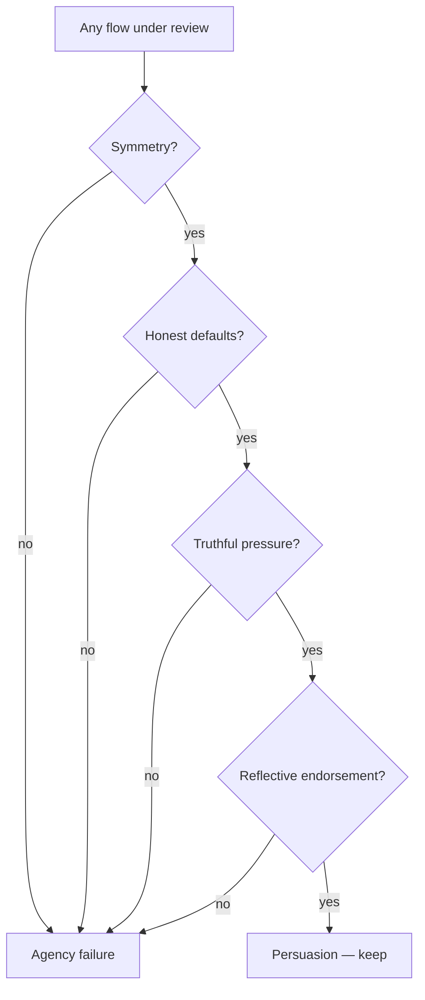

# User Agency

The user's capacity to understand their options and act on their own intent. Preserving it is the ethical boundary of this handbook—and the practical difference between persuasion and manipulation.

## Definition

User agency is informed, revocable choice: the user knows what is happening, can decline or reverse it, and would endorse the outcome on reflection. **Persuasion** works *with* agency—it makes a genuine option more legible, more timely, or easier to take. **Manipulation** works *against* it—it engineers a choice the user would not have made with full information and a fair interface. Dark patterns (Brignull's catalogue: confirmshaming, roach motels, fake urgency, sneaking, nagging) are manipulation with a user interface.

## Why it matters

Every TTP in this handbook has an evil twin, and agency is the test that tells them apart. [Limited Offer](../ttps/limited-offer.md) versus a countdown that resets; [Variable Reward](../ttps/variable-reward.md) versus a slot machine; [Momentum Bias](../ttps/momentum-bias.md) versus defaults that smuggle consent. The pattern's surface can be identical—the difference is whether the user's understanding and options were preserved or exploited.

The practical case is as strong as the moral one. Manipulation converts once and then compounds negatively: regretted purchases churn, coerced permissions get revoked, trapped subscribers become public detractors, and regulators now fine what growth teams once celebrated (the Federal Trade Commission's dark-patterns enforcement, the EU's Digital Services Act ban on deceptive interface design). Agency-preserving design converts less on day one and more over the lifetime, because the users who stay actually chose you.

## Deep dive

A four-question audit that fits any flow:

1. **Symmetry** — Is leaving as easy as entering? Cancel versus subscribe, unsubscribe versus subscribe, deny versus allow. Asymmetry is the signature of extraction ([Graceful Exit](../ttps/graceful-exit.md)).
2. **Honest defaults** — Do pre-selections serve the user's likely intent or your metrics? Would you keep the default if it cost you conversions? ([Setup Defaults](../ttps/setup-defaults.md), [Momentum Bias](../ttps/momentum-bias.md)).
3. **Truthful pressure** — Is every scarcity, timer, and social proof claim literally true, and would it survive being screenshot? ([Limited Offer](../ttps/limited-offer.md)).
4. **Reflective endorsement** — A week later, with full knowledge of what happened, would the user say "good, that's what I wanted"? This is the deepest test: it catches manipulation that was technically disclosed but practically invisible.

Note what agency is *not*: unlimited choice. Curation, defaults, and even added friction can all serve agency—[Intentional Friction](../ttps/intentional-friction.md) protects a user from an irreversible mistake precisely by interrupting momentum. Agency is about whose intent the design serves, not how many options it displays.

### Commercial and consent moments

These TTPs restate the same agency test; use this page as the shared frame and keep card-local Do/Don't for implementation:

- **[The Paywall](../ttps/the-paywall.md)** — standing plan/capability decision when value is already understood.
- **[Limited Offer](../ttps/limited-offer.md)** — a genuine time-bound *delta* on top of a fair paywall, never a substitute for value clarity or a fake countdown.
- **[Setup Defaults](../ttps/setup-defaults.md)** / **[Momentum Bias](../ttps/momentum-bias.md)** — head starts and starter config that remain editable; never sneak consent into a pre-check.
- **[Intent Mirroring](../ttps/intent-mirroring.md)** — moment-local offer from a signal the user can recognise; not coercive inference they cannot inspect ([Personalisation](../ttps/personalisation.md) is the durable, inspectable cousin).
- **[Permission Serve](../ttps/permission-serve.md)** and growth asks — see also [Social Transmission](14-social-transmission.md).

Sibling: [Calibrated Trust](11-calibrated-trust.md) is agency applied to *information* (honest capability); this page is agency applied to *choice*.

## For engineers and agents

- Agency has a backend: "delete my account" must actually delete on the schedule the UI promised, unsubscribe must propagate to every sender, revoked permissions must stop data flows, and exports must contain the user's real data in a usable format. The interface makes the promise; the implementation keeps or breaks it.
- Symmetry is testable: automate walks of join/leave pairs (subscribe→cancel, grant→revoke, opt-in→opt-out) and compare step counts, round-trips, and wall-clock time. A widening asymmetry is a regression even if every individual screen passed review.
- Consent is state, not a modal: store what the user agreed to, when, and under which wording; make current settings inspectable and changeable in one obvious place. Pre-checked boxes, consent bundled into unrelated flows, and defaults that quietly re-enable are all implementation-level dark patterns.
- Copy review is agency review: confirmshaming ("No thanks, I hate saving money"), disguised buttons, and misleading visual hierarchy ship through the same PRs as honest UI. An agent reviewing a diff should flag decline paths that are styled to be missed as readily as it flags a null dereference.
- The reflective-endorsement test automates poorly but proxies well: regret signals (immediate undo, same-session cancellation, refund requests, support tickets that say "I didn't mean to") are measurable. Rising regret after a conversion win means the win was extracted, not earned.

## Where it shows up

- Every TTP card's **Don't** list and **Anti-goals** line encode the agency boundary for that pattern.
- Strategies: [Intent Shaping](../strategies/10-intent-shaping.md), [Monetisation](../strategies/06-monetisation.md), [Conversion Optimisation](../strategies/07-conversion-optimisation.md), [Habit Formation](../strategies/11-habit-formation.md), [Growth & Viral](../strategies/05-growth-viral.md)
- Concepts: [Calibrated Trust](11-calibrated-trust.md), [Friction](04-friction.md) (sludge), [Habit Formation](10-habit-formation.md) (compulsion line), [Social Transmission](14-social-transmission.md)
- Discovery: [How Customers Talk, Search, and Buy](../discovery/04-how-customers-talk-search-buy.md)

## Further reading

- [Deceptive Patterns (Harry Brignull)](https://www.deceptive.design/) — The living catalogue of manipulation patterns, with legal cases.
- [FTC: Bringing Dark Patterns to Light](https://www.ftc.gov/reports/bringing-dark-patterns-light) — Regulatory analysis of how dark patterns harm consumers.
- [Dark Patterns at Scale (Mathur et al., 2019)](https://doi.org/10.1145/3359183) — Empirical measurement of dark patterns across 11,000 shopping sites.
- [Evil by Design (Chris Nodder)](https://www.wiley.com/en-us/Evil+by+Design%3A+Interaction+Design+to+Lead+Us+into+Temptation-p-9781118422144) — Persuasion mechanics catalogued honestly enough to expose the line.
