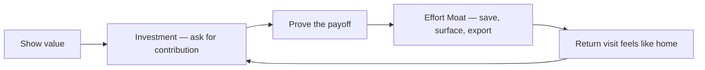

# Investment and Continuity

People attach to products they have shaped—when that shape stays useful, portable, and under their control. Investment is the contribution; continuity is honouring it over time.

## Definition

**Investment** is meaningful user contribution—preferences, creations, organisation, history, taught workflows—that makes a later session better because *they* did the work. **Continuity** is what the product does with that contribution: save it, surface it on return, let them edit and export it, and never hold it hostage. Together they describe the IKEA / endowment dynamic without mistaking sunk-cost traps for loyalty.

Two Tools, Techniques, and Practices (TTPs) implement the halves:

- **[Investment](../ttps/investment.md)** — elicit the smallest contribution that improves the next experience, then prove the payoff.
- **[Effort Moat](../ttps/effort-moat.md)** — honour and continue what users already built: recaps, preserved progress, portability, re-entry without starting from zero.

## Why it matters

Emotionally, “my workspace” feels different from “a tool.” That ownership feeling is earned only when effort returns as utility. Effort that disappears, cannot leave with the user, or exists only to raise switching costs produces resentment—the opposite of attachment. Discovery maps this as switching stakes ([How Customers Work Today](../discovery/03-how-customers-work-today.md)); this concept is the design response.

## Deep dive

Working rules:

1. **Ask after value, not before.** Investment too early is busywork; too late and the product stays generic. Pair with [Time to Value](../ttps/time-to-value.md) and [Sandbox Experience](../ttps/sandbox-experience.md).
2. **Continuity is an engineering feature.** Autosave, version history, durable drafts, export schemas, and reversible imports are the implementation of respect—not polish.
3. **Portability is trust.** Easy export and [Graceful Exit](../ttps/graceful-exit.md) make staying a choice. Hostage data is a dark pattern with a [User Agency](12-user-agency.md) failure signature.
4. **Replay is continuity made visible.** [Value Replay](../ttps/value-replay.md) and [Personalisation](../ttps/personalisation.md) show users that their investment still works for them—without nagging.

Boundary with habit: [Habit Formation](10-habit-formation.md) is about cue-driven return; investment and continuity are about *what* makes returning worthwhile. Streaks that punish miss are compulsion; progress users can keep and take with them is continuity.

## For engineers and agents

- Treat user-created artefacts as first-class data: schema, backup, migration, and export paths before celebrating “stickiness.”
- Re-entry screens should restore context (last project, unfinished draft, chosen defaults)—not a blank home that erases continuity.
- Audit “leaving cost”: if cancel/delete/export is harder than create, you have a hostage pattern, not a moat.
- When reviewing Investment vs Effort Moat: Investment changes ask for contribution; Effort Moat changes preserve/surface/export what already exists. If a PR does both, review against both cards.

## Where it shows up

- TTPs: [Investment](../ttps/investment.md), [Effort Moat](../ttps/effort-moat.md), [Value Replay](../ttps/value-replay.md), [Personalisation](../ttps/personalisation.md), [Graceful Exit](../ttps/graceful-exit.md), [Sandbox Experience](../ttps/sandbox-experience.md)
- Strategies: [Retention](../strategies/03-retention.md), [Habit Formation](../strategies/11-habit-formation.md), [Monetisation](../strategies/06-monetisation.md) (paid continuity must stay fair)
- Concepts: [Jobs-to-be-Done](09-jobs-to-be-done.md) (switching anxiety), [User Agency](12-user-agency.md), [Calibrated Trust](11-calibrated-trust.md)

## Further reading

- [The IKEA Effect (Norton, Mochon & Ariely, 2012)](https://doi.org/10.1016/j.jcps.2011.08.002) — Labour increases liking when the outcome is successfully completed.
- [Endowment Effect (Kahneman, Knetsch & Thaler)](https://doi.org/10.1257/jep.5.1.193) — Ownership raises valuation; design implication is continuity, not lock-in.
- [Graceful Exit](../ttps/graceful-exit.md) — Continuity includes the right to leave with your work.
