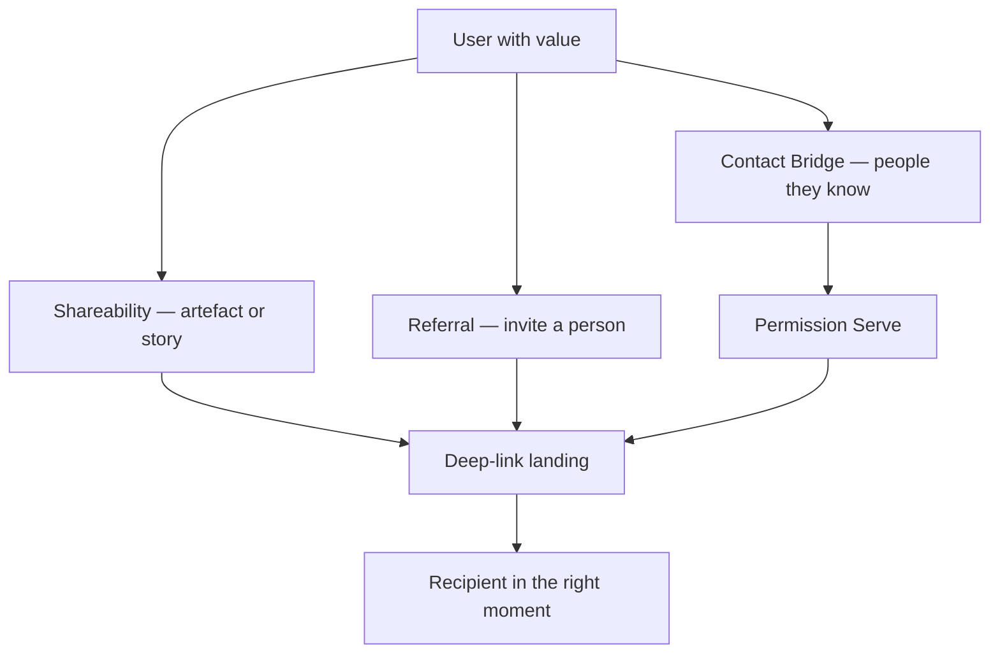

# Social Transmission

How value moves from one person to another: shared artefacts, invited people, and permissioned contact bridges. Growth that feels good respects consent at every hop.

## Definition

**Social transmission** is the set of product behaviours that let a user’s outcome or recommendation reach someone else. Three Tools, Techniques, and Practices (TTPs) cover distinct jobs—do not collapse them:

| Job | TTP | What moves |
|-----|-----|------------|
| Tell the story of a result | [Shareability](../ttps/shareability.md) | An artefact, link, or narrative the user owns |
| Invite someone who would benefit | [Referral](../ttps/referral.md) | A person + a clear, honest path for both sides |
| Connect to people already known | [Contact Bridge](../ttps/contact-bridge.md) | A permissioned people-picker for a user-chosen purpose |

[Deep-link](../ttps/deep-link.md) is the plumbing that lands the recipient in the right moment; [Permission Serve](../ttps/permission-serve.md) is the consent pattern for any sensitive ask (including contacts).

## Why it matters

Reflective emotion—pride, belonging, “I look good recommending this”—is what makes people transmit. Pressure, pre-selected contact lists, or bait-and-switch invites convert once and then brand the product as extractive. Discovery maps where people already talk and seek ([How Customers Talk, Search, and Buy](../discovery/04-how-customers-talk-search-buy.md)); this concept is how in-product growth matches those channels without dark patterns.

## Deep dive

1. **Shareability first.** If the outcome is not worth showing, no invite loop will save growth. Design the shareable moment (export, public link, story card) before the referral mechanic.
2. **Referral is a dual experience.** The inviter needs dignity and control; the invitee needs honesty about what they’re joining and an easy decline. Fake scarcity and guilt copy fail [User Agency](12-user-agency.md).
3. **Contact Bridge is not growth hacking.** Address-book access is a high-trust ask: value must be visible before the prompt, selection must be user-driven, and harvesting contacts for spam is out of scope for this handbook.
4. **Transmission inherits trust.** Broken deep links, surprise paywalls after a share, or mismatched landing states burn both parties—see [Calibrated Trust](11-calibrated-trust.md) and [Surfaces, Flows, and States](03-surfaces-flows-states.md).

## For engineers and agents

- Model three payloads separately: share artefact (URL, image, file), invite token (attribution + landing intent), contact scope (OS permission + in-app selection). Mixing them produces consent bugs.
- Preserve recipient context: campaign/invite metadata should shape first-run and remain queryable—stripping it at the door discards why they came.
- Audit preselection: any control that defaults “invite all” or “share with followers” without an equal-weight decline is a finding.
- When reviewing Growth strategy work, classify the change as Shareability, Referral, or Contact Bridge before applying that card’s Don’t list.

## Where it shows up

- TTPs: [Shareability](../ttps/shareability.md), [Referral](../ttps/referral.md), [Contact Bridge](../ttps/contact-bridge.md), [Deep-link](../ttps/deep-link.md), [Permission Serve](../ttps/permission-serve.md)
- Strategies: [Growth & Viral](../strategies/05-growth-viral.md), [Engagement](../strategies/04-engagement.md)
- Concepts: [Emotional Design](06-emotional-design.md) (reflective layer), [User Agency](12-user-agency.md), [Peak–End Rule](07-peak-end-rule.md) (shared peaks)

## Further reading

- [How Customers Talk, Search, and Buy](../discovery/04-how-customers-talk-search-buy.md) — Where transmission already happens before your product exists.
- [Permission Serve](../ttps/permission-serve.md) — Consent timing for contacts and other sensitive access.
- [Deceptive Patterns: Friend Spam](https://www.deceptive.design/types/friend-spam) — The anti-pattern Contact Bridge and Referral must never become.
