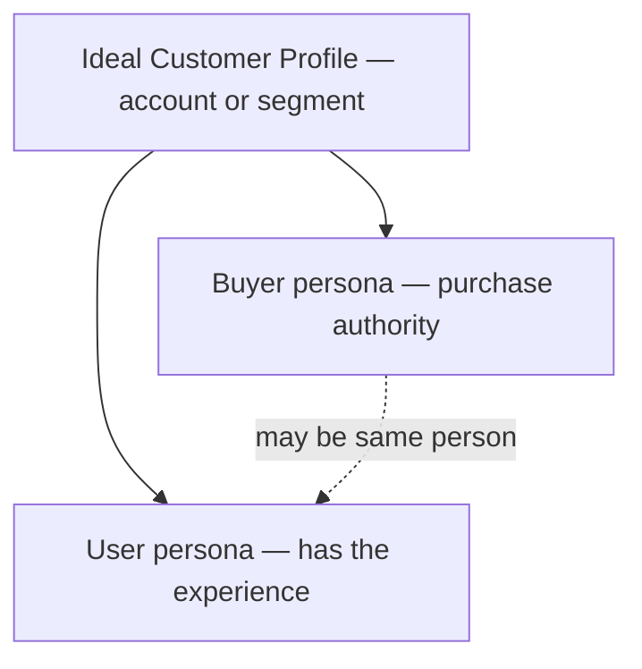

# Ideal Customer and User Profiles

Who gets the most value from your product—and who, specifically, is the human having the experience you are designing? Three distinct artefacts answer this, and collapsing them loses the precision each one exists to provide.

## What it is

- An **Ideal Customer Profile (ICP)** describes the *account or segment* that gets the most value at the least cost to serve: the company (in business-to-business products) or household/segment (in consumer products) most likely to buy, succeed, stay, and refer. It is defined by observable traits—size, stack, situation, behaviour—plus the triggers that start a search.
- A **buyer persona** describes a *person with purchase authority* inside the ICP: their role, the metric they are measured on, their risk exposure if the purchase fails, and their current alternative.
- A **user persona** describes a *person who actually uses the product*: their goals, context, skill level, and emotional stakes in the job. In consumer products buyer and user usually coincide; in business products they often do not—and designing for the buyer while the user suffers (or the reverse) is a classic failure with a feeling signature: enthusiastic procurement, resentful daily use.

## Why it works

The [Feeling North Star](../concepts/01-feeling-north-star.md) has an owner. “Confidence at the first export” means nothing until you know whether the person exporting is a data engineer who fears silent corruption or a marketer who fears looking incompetent in front of a client—the same [surface](../concepts/03-surfaces-flows-states.md) needs different reassurance for each. Personas are how discovery findings stay attached to design decisions; the ICP is how you decide *which* findings count. Feedback from outside your ICP is noise wearing a customer costume: designing for everyone who shouts is how products lose their feeling.

## Going deeper

Working rules for profiles that earn their keep:

1. **Evidence over invention.** A persona is a cluster of patterns from real interviews and behavioural data, not a creative-writing exercise with a stock photo. If you are pre-evidence, write **proto-personas**—explicitly labelled assumptions to be tested—then replace guesses with findings as interviews accumulate.
2. **Few and sharp beats many and vague.** Two or three personas that predict behaviour (“will not grant calendar access before seeing value”) outperform six that catalogue demographics. Keep only distinctions that change a design decision.
3. **Include the emotional layer.** Beyond goals and tasks, capture what this person fears, what makes them feel competent, and what they would be embarrassed by. These fields drive more TTP choices than any demographic: [Permission Serve](../ttps/permission-serve.md) timing, [Fail Safe](../ttps/fail-safe.md) placement, and [Product Voice](../ttps/product-voice.md) register are all persona-dependent.
4. **Name the current alternative.** Every profile should record what this person would do if you did not exist—spreadsheet, competitor, intern, nothing. The current alternative sets the bar your first-value moment has to clear and the switching anxieties you must defuse (see [How Customers Work Today](03-how-customers-work-today.md)).

## For builders and agents

Persona distinctions should be legible in the product: separate onboarding paths, feature flags, or defaults per persona are the implementation of “we serve two different people.” If nothing branches on the difference, the personas are decoration. Segment telemetry by persona proxy from day one (role at signup, plan, usage shape)—an aggregate activation rate across two personas with different jobs is a number about nobody.

The ICP is a prioritisation function for feedback: when triaging requests or usability findings, weight them by whether the reporter matches the ICP. An agent summarising feedback should say which segment it came from, not just how loud it was. Keep profiles where tooling can load them—in `docs/strategy/` via DocSlime—so a coding agent reviewing a surface knows who it is for and what that person fears. “Would Maya trust this dialog?” is answerable only if Maya is written down.

## When to use it

- Before locking a feeling north star or an [Onboarding](../strategies/01-onboarding.md) activation definition
- When buyer and user diverge (enthusiastic procurement, resentful daily use)
- When triage of feedback needs a prioritisation function
- When agents will review surfaces and need a written “who is this for?”

## Do

- Build from interviews and behaviour; label **proto-personas** until evidence replaces guesses
- Keep two or three sharp personas that predict behaviour
- Capture fear, competence, and embarrassment—not only goals and tasks
- Name the current alternative and the switching anxieties it creates
- Make persona distinctions real in paths, defaults, or flags when they change design

## Don't

- Invent demographic fiction with stock photos and no evidence
- Maintain six vague personas that never change a decision
- Design for whoever shouts loudest outside the ICP
- Collapse buyer and user when their jobs and risks differ
- Leave personas only in a slide deck agents and code never see

## Founder Tip

If nothing in the product or docs branches on the persona difference, the persona is decoration—delete or implement it.

## Make It Yours

1. **Name the ICP in observables** — size, stack, situation, trigger that starts a search.
2. **Split buyer vs user** — same person or not? What fails if you only serve one?
3. **Emotional fields** — for each user persona: fear, competence cue, embarrassment risk.
4. **Current alternative** — what they do if you disappear tomorrow.

## Insights & Metrics

1. **Evidence coverage** — (Persona claims with interview or behavioural citation ÷ Total persona claims) × 100. Proto claims stay labelled.
2. **ICP-weighted feedback** — Share of shipped changes whose requesting segment matches ICP (vs non-ICP volume).
3. **Persona-split activation** — Activation by persona proxy—never one aggregate across divergent jobs.

## Behind the Data

- Which persona claims are still proto, and when will you validate or kill them?
- Does telemetry let you segment by the distinctions you claim?
- Are you overweighting a vocal non-ICP segment in the roadmap?

## Related concepts

- [Feeling North Star](../concepts/01-feeling-north-star.md), [Jobs-to-be-Done](../concepts/09-jobs-to-be-done.md)
- Consumed by: [Onboarding](../strategies/01-onboarding.md), [Activation](../strategies/02-activation.md), [JTBD Copywriting](../ttps/jtbd-copywriting.md), [Personalisation](../ttps/personalisation.md), [Permission Serve](../ttps/permission-serve.md)

## Further reading

- [Personas Make Users Memorable (Nielsen Norman Group)](https://www.nngroup.com/articles/persona/) — What personas are for and what makes them evidence-based.
- [Personas: Study Guide (NN/g)](https://www.nngroup.com/articles/personas-study-guide/) — Types, creation, and use.
- [What is a Buyer Persona? (Buyer Persona Institute)](https://buyerpersona.com/what-is-a-buyer-persona) — Personas built from real purchase decisions.
- [The Four Steps to the Epiphany (Steve Blank)](https://web.stanford.edu/class/e145/2008_fall/materials/Cases_and_Readings/Four_Steps.pdf) — Hypotheses about who the customer is.

## Agent skill

- **Primary command:** `/productfeeling persona` — run the surface through distinct emotional lenses
- **Related commands:** `/productfeeling jobs`, `/productfeeling init`, `/productfeeling sequence` (Customer discovery)
- **When the agent should load this page:** "who is this for", "ICP", "buyer vs user", "persona", "segment"
- **Companion handoff:** DocSlime — durable ICP/persona narrative in `docs/strategy/`; never a second SoT in `.productfeeling/`. Impeccable only after synthesis/north star. RedTeam — `/redteam assumptions` before locking ICP. No external discovery skill.
- **Feeling north star this practice serves:** design for a named owner, not an average nobody
- **Anti-goals:** demographic fiction, designing for non-ICP noise, buyer/user collapse that hides resentment
- **Reference path:** `skill/reference/persona.md`
- **Durable DocSlime targets:** `docs/strategy/` (ICP, buyer/user personas); refresh via `init` / `handoff`
