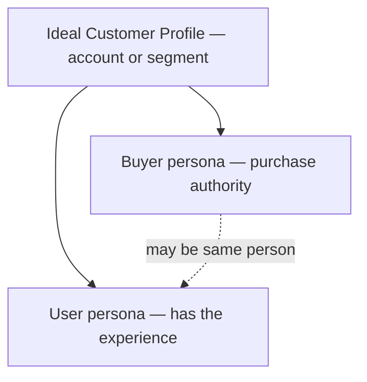

# Ideal Customer and User Profiles

Who gets the most value from your product—and who, specifically, is the human having the experience you are designing? Three distinct artefacts answer this, and collapsing them loses the precision each one exists to provide.

## Definition

- An **Ideal Customer Profile (ICP)** describes the *account or segment* that gets the most value at the least cost to serve: the company (in business-to-business products) or household/segment (in consumer products) most likely to buy, succeed, stay, and refer. It is defined by observable traits—size, stack, situation, behaviour—plus the triggers that start a search.
- A **buyer persona** describes a *person with purchase authority* inside the ICP: their role, the metric they are measured on, their risk exposure if the purchase fails, and their current alternative.
- A **user persona** describes a *person who actually uses the product*: their goals, context, skill level, and emotional stakes in the job. In consumer products buyer and user usually coincide; in business products they often do not—and designing for the buyer while the user suffers (or the reverse) is a classic failure with a feeling signature: enthusiastic procurement, resentful daily use.

## Why it matters

The [Feeling North Star](../concepts/01-feeling-north-star.md) has an owner. "Confidence at the first export" means nothing until you know whether the person exporting is a data engineer who fears silent corruption or a marketer who fears looking incompetent in front of a client—the same [surface](../concepts/03-surfaces-flows-states.md) needs different reassurance for each. Personas are how discovery findings stay attached to design decisions; the ICP is how you decide *which* findings count. Feedback from outside your ICP is noise wearing a customer costume: designing for everyone who shouts is how products lose their feeling.

## Deep dive

Working rules for profiles that earn their keep:

1. **Evidence over invention.** A persona is a cluster of patterns from real interviews and behavioural data, not a creative-writing exercise with a stock photo. If you are pre-evidence, write **proto-personas**—explicitly labelled assumptions to be tested—then replace guesses with findings as interviews accumulate.
2. **Few and sharp beats many and vague.** Two or three personas that predict behaviour ("will not grant calendar access before seeing value") outperform six that catalogue demographics. Keep only distinctions that change a design decision.
3. **Include the emotional layer.** Beyond goals and tasks, capture what this person fears, what makes them feel competent, and what they would be embarrassed by. These fields drive more TTP choices than any demographic: [Permission Serve](../ttps/permission-serve.md) timing, [Fail Safe](../ttps/fail-safe.md) placement, and [Product Voice](../ttps/product-voice.md) register are all persona-dependent.
4. **Name the current alternative.** Every profile should record what this person would do if you did not exist—spreadsheet, competitor, intern, nothing. The current alternative sets the bar your first-value moment has to clear and the switching anxieties you must defuse (see [How Customers Work Today](03-how-customers-work-today.md)).

## For engineers and agents

- Persona distinctions should be legible in the code: separate onboarding paths, feature flags, or defaults per persona are the implementation of "we serve two different people." If nothing in the codebase branches on the difference, the personas are decoration.
- Segment telemetry by persona proxy from day one (role selected at signup, plan, usage shape). An aggregate activation rate across two personas with different jobs is a number about nobody.
- The ICP is a prioritisation function for feedback: when triaging feature requests or usability findings, weight them by whether the reporter matches the ICP. An agent summarising user feedback should say which segment it came from, not just how loud it was.
- Keep profiles where tooling can load them—alongside `FEELING.md` in project context—so a coding agent reviewing a surface knows who it is for and what that person fears. "Would Maya trust this dialog?" is answerable only if Maya is written down.

## Where it shows up

- [Onboarding](../strategies/01-onboarding.md) and [Activation](../strategies/02-activation.md) depend on persona-specific definitions of first value.
- [JTBD Copywriting](../ttps/jtbd-copywriting.md) and [Personalisation](../ttps/personalisation.md) are persona-driven TTPs; [Jobs-to-be-Done](../concepts/09-jobs-to-be-done.md) is the complementary lens (the job is stable; personas describe who is hiring).

## Further reading

- [Personas Make Users Memorable for Product Team Members (Nielsen Norman Group)](https://www.nngroup.com/articles/persona/) — What personas are for and what makes them evidence-based.
- [Personas: Study Guide (NN/g)](https://www.nngroup.com/articles/personas-study-guide/) — A curated path through persona types, creation, and use.
- [What is a Buyer Persona? (Buyer Persona Institute)](https://buyerpersona.com/what-is-a-buyer-persona) — The buying-insights view: personas built from real purchase decisions.
- [The Four Steps to the Epiphany (Steve Blank)](https://web.stanford.edu/class/e145/2008_fall/materials/Cases_and_Readings/Four_Steps.pdf) — Customer discovery as hypothesis testing about who the customer is.
