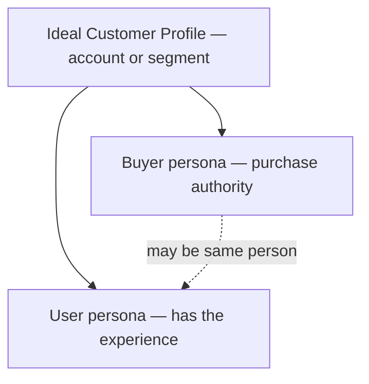

# Ideal Customer and User Profiles

Who gets the most value—and who, specifically, has the experience you are designing.

## What it is

Three artefacts, kept distinct:

- **Ideal Customer Profile (ICP)** — the account or segment that gets the most value at the least cost to serve: observable traits, situation, behaviour, and search triggers.
- **Buyer persona** — a person with purchase authority inside the ICP: role, metric they own, risk if the purchase fails, current alternative.
- **User persona** — a person who uses the product: goals, context, skill, emotional stakes. In consumer products buyer and user often coincide; in business products they often do not.

## Why it works

The [Feeling North Star](../concepts/01-feeling-north-star.md) needs an owner. The same [surface](../concepts/03-surfaces-flows-states.md) needs different reassurance for a data engineer who fears silent corruption than for a marketer who fears looking incompetent. Personas attach discovery to design; the ICP decides *which* findings count. Feedback from outside the ICP is noise wearing a customer costume.

## When to use it

- Before locking a feeling north star or an [Onboarding](../strategies/01-onboarding.md) activation definition
- When buyer and user diverge (enthusiastic procurement, resentful daily use)
- When triage of feedback, requests, or usability findings needs a prioritisation function
- When agents will review surfaces and need a written “who is this for?”

## Do

- Build from interviews and behaviour; label **proto-personas** explicitly until evidence replaces guesses
- Keep two or three sharp personas that predict behaviour (“will not grant calendar access before value”)
- Capture the emotional layer: what they fear, what makes them feel competent, what would embarrass them
- Name the **current alternative** (spreadsheet, competitor, intern, nothing)—the bar first value must clear
- Make persona distinctions legible in product paths, defaults, or flags when they change design

## Don't

- Invent demographic fiction with stock photos and no evidence
- Maintain six vague personas that never change a decision
- Design for whoever shouts loudest outside the ICP
- Collapse buyer and user when their jobs and risks differ
- Leave personas only in a slide deck agents and code never see

## Founder Tip

If nothing in the product or docs branches on the persona difference, the persona is decoration—delete or implement it.

## Make It Yours

1. **Name the ICP in observables** — size, stack, situation, trigger that starts a search.
2. **Split buyer vs user** — same person or not? What fails if you only serve one?
3. **Emotional fields** — for each user persona: fear, competence cue, embarrassment risk.
4. **Current alternative** — what they do if you disappear tomorrow.

## Insights & Metrics

1. **Evidence coverage** — (Persona claims with interview or behavioural citation ÷ Total persona claims) × 100. Proto claims stay labelled.
2. **ICP-weighted feedback** — Share of shipped changes whose requesting segment matches ICP (vs non-ICP volume).
3. **Persona-split activation** — Activation rate by persona proxy (role, plan, usage shape)—never one aggregate across divergent jobs.

## Behind the Data

- Which persona claims are still proto, and when will you validate or kill them?
- Does telemetry or signup data let you segment by the distinctions you claim?
- Are you overweighting a vocal non-ICP segment in the roadmap?

## Related concepts

- [Feeling North Star](../concepts/01-feeling-north-star.md), [Jobs-to-be-Done](../concepts/09-jobs-to-be-done.md)
- Consumed by: [Onboarding](../strategies/01-onboarding.md), [Activation](../strategies/02-activation.md), [JTBD Copywriting](../ttps/jtbd-copywriting.md), [Personalisation](../ttps/personalisation.md), [Permission Serve](../ttps/permission-serve.md)

## Further reading

- [Personas Make Users Memorable (Nielsen Norman Group)](https://www.nngroup.com/articles/persona/) — Evidence-based personas.
- [Personas: Study Guide (NN/g)](https://www.nngroup.com/articles/personas-study-guide/) — Types, creation, use.
- [What is a Buyer Persona? (Buyer Persona Institute)](https://buyerpersona.com/what-is-a-buyer-persona) — Buying-insights view.
- [The Four Steps to the Epiphany (Steve Blank)](https://web.stanford.edu/class/e145/2008_fall/materials/Cases_and_Readings/Four_Steps.pdf) — Hypotheses about who the customer is.

## Agent skill

- **Primary command:** `/productfeeling persona` — run the surface through distinct emotional lenses
- **Related commands:** `/productfeeling jobs`, `/productfeeling init`, `/productfeeling sequence` (Customer discovery)
- **When the agent should load this page:** "who is this for", "ICP", "buyer vs user", "persona", "segment"
- **Companion handoff:** DocSlime — durable ICP/persona narrative in `docs/strategy/` (e.g. market-and-users or focused persona files); never a second SoT in `.productfeeling/`. Impeccable only after synthesis/north star. RedTeam — `/redteam assumptions` before locking ICP. No external discovery skill.
- **Feeling north star this practice serves:** design for a named owner, not an average nobody
- **Anti-goals:** demographic fiction, designing for non-ICP noise, buyer/user collapse that hides resentment
- **Reference path:** `skill/reference/persona.md`
- **Durable DocSlime targets:** `docs/strategy/` (ICP, buyer/user personas); refresh via `init` / `handoff`
