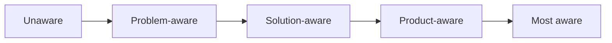
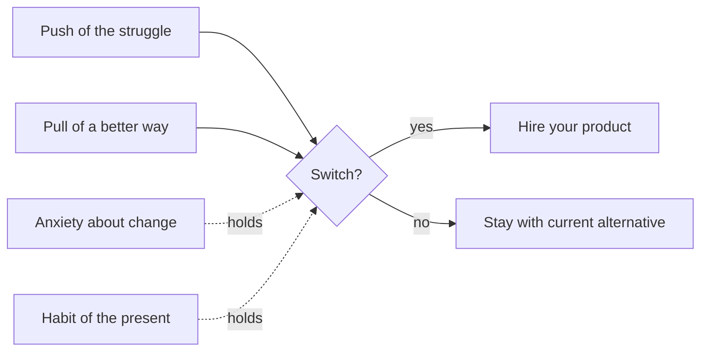

# Need States and Awareness

People do not arrive at your product in general; they arrive in a *state*—a circumstance, an emotional charge, and a level of awareness about their problem and its solutions. Diagnosing that state is what lets the first surface meet them where they are.

## Definition

A **need state** is the combination of circumstance and motivation that activates a job: not "users need expense tracking" but "it is the last day of the quarter, the receipts pile has become unbearable, and I feel behind." The same person cycles through different need states; the same need state recurs across very different people. Need states carry emotion by definition—urgency, dread, hope, embarrassment—which is why they, not demographics, are the natural unit for emotional design.

**Awareness** is the second axis: how far the person has already travelled toward a solution. Eugene Schwartz's five stages of awareness (from *Breakthrough Advertising*, 1966) remain the standard vocabulary:

1. **Unaware** — does not yet recognise the problem.
2. **Problem-aware** — feels the pain, does not know solutions exist.
3. **Solution-aware** — knows the category exists, not your product.
4. **Product-aware** — knows your product, is comparing and doubting.
5. **Most aware** — convinced, needs only a fair final step.

Design moves people **one stage** at a time. Jumping from problem-aware to paying is where pressure tactics breed.

## Why it matters

Mismatch between a surface and the arriving state is one of the most common emotional failures in product design. A feature tour is welcome to a solution-aware evaluator and noise to a problem-aware arrival who needs their pain named first. A discount feels helpful at most-aware and cheapens the product at problem-aware. "Why don't users get it?" is usually a diagnosis error: the surface was written for a state its visitors are not in.

The forces of progress (from the [Jobs-to-be-Done](../concepts/09-jobs-to-be-done.md) tradition) complete the diagnosis:

Push and pull supply motivation; anxiety and habit are the emotional [friction](../concepts/04-friction.md) discovery must surface—because your product, not your marketing, is what has to defuse them ([Sandbox Experience](../ttps/sandbox-experience.md), [Fail Safe](../ttps/fail-safe.md), [Effort Moat](../ttps/effort-moat.md)). The habit force is the physics of the present alternative ([Habit Formation](../concepts/10-habit-formation.md)); pressure that jumps someone from problem-aware to paying fails [User Agency](../concepts/12-user-agency.md).

## Deep dive

Diagnosing need states in discovery interviews:

1. **Reconstruct real episodes, not opinions.** "Walk me through the last time this became urgent" recovers the circumstance, the trigger, and the emotion; "how important is this problem to you?" recovers politeness. The trigger event—what made *that day* the day they went looking—is the single highest-value fact in the interview.
2. **Capture the emotional vocabulary verbatim.** The words people use for their state ("drowning," "flying blind," "babysitting the spreadsheet") are both diagnostic data and future copy (see [How Customers Talk, Search, and Buy](04-how-customers-talk-search-buy.md)).
3. **Map states to entry points.** Different need states arrive through different doors: a problem-aware reader lands on a blog post; a product-aware evaluator lands on pricing; a most-aware buyer arrives from a referral and just wants signup to not fumble the handoff. Each entrance deserves a surface tuned to its state.
4. **Design the state transition, not just the conversion.** A surface's job is to move a person one stage—problem-aware to solution-aware, product-aware to convinced—by teaching, demonstrating, or de-risking ([Spark Curiosity](../ttps/spark-curiosity.md), [Sandbox Experience](../ttps/sandbox-experience.md)). Trying to jump someone from problem-aware to paying in one screen is where pressure tactics breed.

## For engineers and agents

- Need states are routing logic: entry point, referrer, campaign, and first-session behaviour are the observable proxies for the arriving state. Landing every source on the same generic homepage is a decision to serve one state and disappoint the rest ([Deep-link](../ttps/deep-link.md)).
- Instrument the trigger, not just the visit: the events preceding signup (searched for what, read what, came from where) tell you which state your acquisition actually attracts—often not the state the product was designed for, which explains many "activation problems."
- Onboarding questions are state diagnosis when they change what happens next ("what brings you here today?" → different first-run paths) and are friction when they do not ([Commitment](../ttps/commitment.md), [Intent Mirroring](../ttps/intent-mirroring.md)).
- For agents reviewing a surface: identify which awareness stage the copy assumes, then check which stage actually arrives there (traffic sources, referrers). Flag mismatches—the fix is usually rewriting for the real state or re-routing the traffic, not more persuasion.

## Where it shows up

- [Onboarding](../strategies/01-onboarding.md) and [Conversion Optimisation](../strategies/07-conversion-optimisation.md) are state-matching strategies end to end.
- [Intent Shaping](../strategies/10-intent-shaping.md) formalises inviting the user to declare their state instead of guessing it.

## Further reading

- [Eugene Schwartz (Wikipedia)](https://en.wikipedia.org/wiki/Eugene_Schwartz) — Context for *Breakthrough Advertising* and the five stages of awareness.
- [The Ultimate Guide to JTBD with Bob Moesta (Lenny's Newsletter)](https://www.lennysnewsletter.com/p/the-ultimate-guide-to-jtbd-bob-moesta) — The forces of progress and switch-interview technique, in practical form.
- [Know Your Customers' "Jobs to Be Done" (Christensen et al., HBR)](https://hbr.org/2016/09/know-your-customers-jobs-to-be-done) — Circumstance-first framing of demand.
- [Empathy Mapping (Nielsen Norman Group)](https://www.nngroup.com/articles/empathy-mapping/) — A lightweight format for capturing what users say, think, do, and feel in a state.
