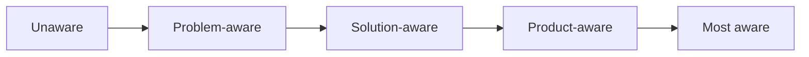

# Need States and Awareness

People arrive in a *state*—circumstance, emotional charge, and how far they have travelled toward a solution.

## What it is

A **need state** is circumstance plus motivation that activates a job: not “users need expense tracking” but “last day of the quarter, receipts unbearable, I feel behind.” Need states carry emotion by definition.

**Awareness** (Eugene Schwartz) is the second axis:

1. **Unaware** — does not yet recognise the problem.
2. **Problem-aware** — feels the pain; does not know solutions exist.
3. **Solution-aware** — knows the category; not your product.
4. **Product-aware** — knows you; comparing and doubting.
5. **Most aware** — convinced; needs a fair final step.

Design moves people **one stage** at a time.

## Why it works

Mismatch is a common emotional failure: a feature tour welcomes a solution-aware evaluator and noisily fails a problem-aware arrival who needs their pain named first. [Jobs-to-be-Done](../concepts/09-jobs-to-be-done.md) forces complete the picture—push and pull motivate; anxiety and habit hold people in the current alternative ([Friction](../concepts/04-friction.md), [User Agency](../concepts/12-user-agency.md)).

## When to use it

- Choosing first-run, landing, or campaign surfaces
- Diagnosing “users don’t get it” (often wrong state, not wrong IQ)
- Designing state transitions ([Sandbox Experience](../ttps/sandbox-experience.md), [Spark Curiosity](../ttps/spark-curiosity.md))
- Instrumenting acquisition: which state does traffic actually bring?

## Do

- Reconstruct real episodes: “Walk me through the last time this became urgent”—capture trigger, circumstance, emotion
- Capture emotional vocabulary verbatim (“drowning,” “flying blind”) for later copy
- Map states to entry points (blog ≠ pricing ≠ referral signup)
- Move one awareness stage per surface; de-risk rather than leap to payment
- Use onboarding questions only when answers change the path ([Commitment](../ttps/commitment.md), [Intent Mirroring](../ttps/intent-mirroring.md))

## Don't

- Write one generic homepage for every arrival state
- Jump problem-aware users straight to pay with pressure tactics
- Ask “how important is this?” instead of reconstructing the last episode
- Ignore anxiety and habit forces when diagnosing switch resistance

## Founder Tip

The trigger event—what made *that day* the day they went looking—is usually the highest-value fact in the interview.

## Make It Yours

1. **List entry doors** — search, referral, comparison, cold homepage—and the state each implies.
2. **Name the trigger** — for your ICP’s last real episode.
3. **One-stage job** — for each key surface: from which stage to which next stage?
4. **Check traffic** — do referrers and campaigns match the state your copy assumes?

## Insights & Metrics

1. **Trigger capture rate** — Interviews (or signup answers) with a concrete trigger event ÷ Total discovery interviews.
2. **State mismatch** — Share of sessions where assumed awareness (copy/UX) ≠ inferred arrival (source, behaviour).
3. **Stage-appropriate conversion** — Conversion by entry state; watch for pressure spikes on problem-aware traffic.

## Behind the Data

- Which awareness stage does your highest-volume channel actually deliver?
- Where do you ask people to skip a stage?
- Do activation “problems” track a state mismatch more than a feature gap?

## Related concepts

- [Jobs-to-be-Done](../concepts/09-jobs-to-be-done.md), [Friction](../concepts/04-friction.md), [User Agency](../concepts/12-user-agency.md), [Habit Formation](../concepts/10-habit-formation.md)
- Consumed by: [Onboarding](../strategies/01-onboarding.md), [Conversion Optimisation](../strategies/07-conversion-optimisation.md), [Intent Shaping](../strategies/10-intent-shaping.md), [Sandbox Experience](../ttps/sandbox-experience.md), [Deep-link](../ttps/deep-link.md)

## Further reading

- [Eugene Schwartz (Wikipedia)](https://en.wikipedia.org/wiki/Eugene_Schwartz) — *Breakthrough Advertising* and five stages of awareness.
- [The Ultimate Guide to JTBD with Bob Moesta (Lenny's Newsletter)](https://www.lennysnewsletter.com/p/the-ultimate-guide-to-jtbd-bob-moesta) — Forces of progress; switch interviews.
- [Know Your Customers' "Jobs to Be Done" (HBR)](https://hbr.org/2016/09/know-your-customers-jobs-to-be-done) — Circumstance-first demand.
- [Empathy Mapping (NN/g)](https://www.nngroup.com/articles/empathy-mapping/) — Say / think / do / feel in a state.

## Agent skill

- **Primary command:** `/productfeeling jobs` — before/during/after emotional jobs tied to the arriving state
- **Related commands:** `/productfeeling persona`, `/productfeeling map`, `/productfeeling sequence` (Customer discovery)
- **When the agent should load this page:** "need state", "awareness stage", "why now", "trigger", "arrival state"
- **Companion handoff:** DocSlime — entry states and journey notes in `docs/experience/`. Impeccable after synthesis. RedTeam if locking a funnel that jumps stages. No external discovery skill.
- **Feeling north star this practice serves:** meet people in the state they are in
- **Anti-goals:** stage-jumping pressure, one surface for every arrival, hypothetical “importance” instead of episodes
- **Reference path:** `skill/reference/jobs.md`
- **Durable DocSlime targets:** `docs/experience/` (need states, entry doors, journey stages)
