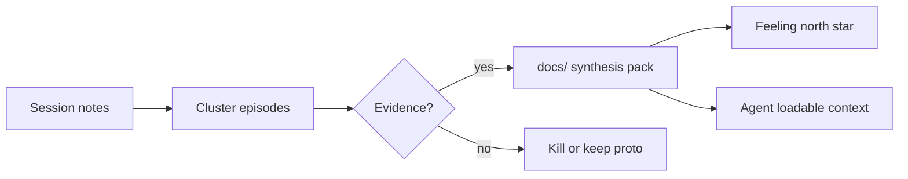

# Synthesis

Turn discovery evidence into durable artifacts the team—and agents—can load before locking a feeling north star. Synthesis is the gate: listening without writing changes nothing; writing without evidence invents customers.

## What it is

**Synthesis** clusters episodes, promotes or kills proto-personas, and writes Ideal Customer Profile (ICP), need states, workflow, and voice of the customer (VoC) into project docs—then leaves ephemeral notes behind. Until that pack lands in a DocSlime-shaped `docs/` tree, strategies and Tools, Techniques, or Practices (TTPs) are guessing with confidence.

This is not a second product narrative in `.productfeeling/`. Reviews and raw sessions stay local; **truth** lives in `docs/strategy/`, `docs/experience/`, and when appropriate `docs/PRODUCT.md` / `DESIGN.md`. A slide deck outside the repo is not a source of truth for agents.

## Why it works

Scattered interview notes do not change onboarding copy or paywall trust. Named files with owners, evidence links, and a last-validated date do. Humans forget; agents invent. Both failure modes shrink when “who is this for, what do they fear, what is the current alternative?” is answerable from the repo without a chat reconstruction.

Synthesis also prevents “we talked to users” theatre. If a discovery week ends with no durable file changed, discovery did not finish—regardless of how many coffees were booked. Hypothesis-driven work (Blank) ends in a decision: promote the claim, revise it, or kill it. Compliments and future-tense enthusiasm do not graduate.

## Going deeper

How to synthesise without turning transcripts into a second novel:

1. **Cluster before you write.** Group episodes by need state, segment, and job—not by interviewee name. Patterns that survive three independent stories become candidates for personas and north-star ownership; one-offs stay footnotes.
2. **Promote with citations; proto everything else.** A claim in `docs/` should point at interviews or behavioural sources and carry a **last validated** date. Assumptions keep an explicit **proto-** label—or get deleted. Designing on unlabeled guesses is how fiction becomes roadmap.
3. **Separate ephemeral from durable.** Session notes, audio, and scratch capture cards may live in `.productfeeling/sessions/`. ICP, personas, journey, workflow, and language graduate to `docs/`. Do not dump full transcripts into the product narrative.
4. **Write the minimum pack that agents can load.** Typically: ICP + buyer/user split in strategy; need states and workflow/journey in experience; language and voice cues in PRODUCT/DESIGN. Enough that `/productfeeling persona` and `jobs` do not invent Maya.
5. **Gate the north star.** Lock [Feeling North Star](../concepts/01-feeling-north-star.md) only when an owner persona and their fear/competence stakes are evidenced—not when a workshop produced a vibe word. Optionally stress-test ICP assumptions with RedTeam before strategy lock.

## For builders and agents

Synthesis is an integration point for the skill. Run `/productfeeling sequence` (Customer discovery) ending in `handoff`, or `/productfeeling init` then `/productfeeling handoff` when refreshing a thin docs tree. Prefer DocSlime fill/kiss when scaffolds still contain prompts; do not duplicate truth into skill-local files when `docs/` exists.

For agents summarising discovery: refuse to invent segments; quote or cite; label uncertainty. For humans: put owners on files so freshness is someone’s job. Instrument the meta-metric—days since ICP last validated—and treat stale personas as a product risk equal to stale code dependencies.

Impeccable craft comes **after** synthesis. Polishing surfaces for an unwritten customer is expensive fiction.

## When to use it

- After a round of interviews (or continuous discovery cadence)
- Before locking [Feeling North Star](../concepts/01-feeling-north-star.md) or running a strategy playbook
- When proto-personas have enough evidence to promote or delete
- When agents keep inventing customers because nothing is in `docs/`

## Do

- Promote claims with evidence; keep **proto-** labels on the rest—or delete them
- Write a short synthesis pack to agreed paths (see Durable targets below)
- Link claims to interviews or behavioural sources; date **last validated**
- Separate: session notes (ephemeral) vs product/experience truth (durable)
- Run `/productfeeling handoff` (DocSlime) when the docs tree is scaffold-thin—fill/kiss as needed
- Optionally stress-test ICP assumptions with RedTeam before locking strategy

## Don't

- Dump interview transcripts into `docs/` as the narrative
- Duplicate ICP/journey truth into `.productfeeling/` when `docs/` exists
- Lock a north star on proto-personas alone
- Skip synthesis and jump straight to Impeccable craft
- Treat a slide deck outside the repo as the SoT for agents

## Founder Tip

If an agent cannot answer “who is this for and what do they fear?” from `docs/`, synthesis is not done.

## Make It Yours

1. **Kill list** — proto claims to delete this week.
2. **File map** — which discovery outputs land in which `docs/` paths.
3. **Evidence links** — one citation per major persona and need-state claim.
4. **Gate check** — north star and next strategy blocked until synthesis pack exists.

## Insights & Metrics

1. **Graduation rate** — Validated claims written to `docs/` ÷ Claims still only in sessions/chat.
2. **Freshness** — Days since ICP / primary persona **last validated** (set a team threshold).
3. **Agent loadability** — Can `context.mjs` / selective docs load name owner + fear + current alternative without chat invention?

## Behind the Data

- What is still proto that you are already designing as fact?
- Where does truth live today—repo, Notion, or someone’s head?
- Did the last “discovery week” change a single durable file?

## Related concepts

- [Feeling North Star](../concepts/01-feeling-north-star.md), [Jobs-to-be-Done](../concepts/09-jobs-to-be-done.md)
- Inputs: [01](01-ideal-customer-and-users.md)–[05](05-interview-method.md); outputs feed all [Strategies](../strategies/index.md)

## Further reading

- [Customer Development is Not a Focus Group (Steve Blank)](https://steveblank.com/2009/11/30/customer-development-is-not-a-focus-group/) — Hypotheses in, decisions out.
- [The Mom Test (Rob Fitzpatrick)](https://www.momtestbook.com/) — What counts as evidence worth writing down.
- [DocSlime](https://www.docslime.dev/) — Opinionated `docs/` tree for durable product context.

## Agent skill

- **Primary command / sequence:** `/productfeeling sequence` — Customer discovery playbook ending in `handoff`; or `/productfeeling init` then `/productfeeling handoff` when refreshing docs
- **Related commands:** `/productfeeling persona`, `/productfeeling jobs`, `/productfeeling brief` (only after north star is grounded)
- **When the agent should load this page:** "synthesis", "write up discovery", "update personas in docs", "graduate findings", "before north star"
- **Companion handoff:** **DocSlime** — primary: write/update the synthesis pack in `docs/`; fill/kiss if scaffold-thin. **Impeccable** — only after north star / emotion brief. **RedTeam** — `/redteam assumptions` on ICP before locking. No external discovery skill.
- **Feeling north star this practice serves:** grounded clarity that survives the next session and the next agent
- **Anti-goals:** transcript dumps as docs, dual SoT in `.productfeeling/`, craft before synthesis
- **Reference path:** `skill/reference/sequence.md`
- **Durable DocSlime targets:**
  - `docs/strategy/` — ICP, personas, market/buy notes
  - `docs/experience/` — need states, workflow, journeys
  - `docs/PRODUCT.md` / `DESIGN.md` — voice, language, constraints
  - Ephemeral: `.productfeeling/sessions/`, `.productfeeling/reviews/` — not a second narrative
