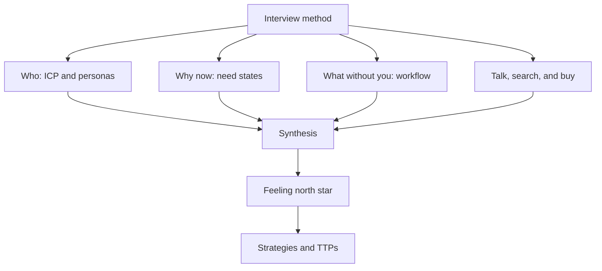

# Customer Discovery

You cannot design a feeling for someone you have not met. Every strategy and Tool, Technique, or Practice (TTP) in this handbook assumes you know *whose* experience you are designing—who the customer is, what state of need they arrive in, and how they already work, talk, search, and buy. The [Feeling North Star](../concepts/01-feeling-north-star.md) has an owner; this section is how you find that owner *before* you lock the feeling.

**Customer discovery** (Steve Blank) means testing hypotheses about the customer's problem *outside the building*—listening in real context—before committing to a solution, a funnel, or a north star. Each page below teaches the idea in full (definitions, mechanisms, practice), then offers worksheets and an agent path. The worksheets are tools; they are not a substitute for the knowledge. This is not a discovery textbook, but it is the minimum emotional product design cannot skip.

**Interview method** runs through every question. **Synthesis** is the gate: validated findings become durable project docs (DocSlime / `docs/`) before you lock a north star or run a strategy.

| Page | Question |
|------|----------|
| [Ideal Customer and User Profiles](01-ideal-customer-and-users.md) | **Who** gets the most value—and who has the experience? |
| [Need States and Awareness](02-need-states.md) | **Why now?** Circumstance, emotional charge, awareness stage |
| [How Customers Work Today](03-how-customers-work-today.md) | **What without you?** Workflow, tools, workarounds |
| [How Customers Talk, Search, and Buy](04-how-customers-talk-search-buy.md) | **In whose words, which channels, what buy process?** |
| [Interview Method](05-interview-method.md) | **How do you ask** so you get evidence, not politeness? |
| [Synthesis](06-synthesis.md) | **What becomes durable**—and where does it live for agents? |

Skill path: `/productfeeling sequence` → **Customer discovery** playbook (`init → persona → jobs → map → tone → handoff`). No external discovery skill—ProductFeeling + DocSlime.

## Further reading

- [The Four Steps to the Epiphany (Steve Blank)](https://web.stanford.edu/class/e145/2008_fall/materials/Cases_and_Readings/Four_Steps.pdf) — Customer development and the discovery/validation sequence.
- [Customer Development is Not a Focus Group (Steve Blank)](https://steveblank.com/2009/11/30/customer-development-is-not-a-focus-group/) — Discovery tests hypotheses; it does not collect feature requests.
- [The Mom Test (Rob Fitzpatrick)](https://www.momtestbook.com/) — Questions that produce evidence instead of politeness.
- [User Interviews 101 (Nielsen Norman Group)](https://www.nngroup.com/articles/user-interviews/) — Interview craft: structure, probing, and bias avoidance.
