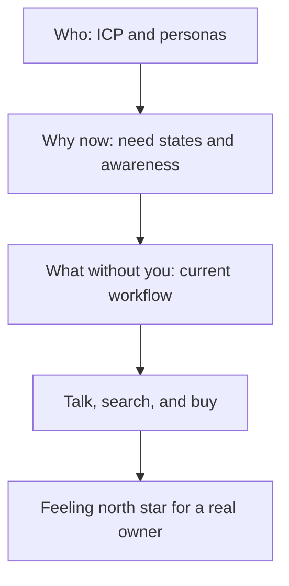

# Customer Discovery

You cannot design a feeling for someone you have not met. Every strategy and Tool, Technique, or Practice (TTP) in this handbook assumes you know *whose* experience you are designing—who the customer is, what state of need they arrive in, and how they already work, talk, search, and buy. This section covers that prerequisite. The [Feeling North Star](../concepts/01-feeling-north-star.md) has an owner; [Concepts](../concepts/index.md) name the mechanisms you will apply once that owner is clear.

The term comes from Steve Blank's customer development model: **customer discovery** is the phase where you test your hypotheses about the customer's problem *outside the building*—by listening to real people in their real context—before committing to a solution, a funnel, or a feeling north star. This is not a customer discovery textbook; it is the minimum understanding emotional product design cannot succeed without.

Four questions, one page each—answer them in order before you design the feeling:

- [Ideal Customer and User Profiles](01-ideal-customer-and-users.md): **Who** gets the most value—and who, specifically, has the experience? Ideal Customer Profile (ICP), buyer personas, and user personas, kept distinct.
- [Need States and Awareness](02-need-states.md): **Why now?** The circumstance, emotional charge, and stage of awareness a person arrives with—and why your first surface must match it.
- [How Customers Work Today](03-how-customers-work-today.md): **What happens without you?** The current workflow, tools, and workarounds your product must fit into or replace.
- [How Customers Talk, Search, and Buy](04-how-customers-talk-search-buy.md): **In whose words, through which channels, by what process?** Voice of the customer, solution-seeking behaviour, and the buying journey.

One method note before the pages: discovery is listening, not pitching. Ask about past behaviour ("walk me through the last time this happened"), not hypothetical enthusiasm ("would you use a tool that…?")—people are generous with predictions and honest only about the past. Rob Fitzpatrick's *The Mom Test* is the compact standard for getting this right.

## Further reading

- [The Four Steps to the Epiphany (Steve Blank)](https://web.stanford.edu/class/e145/2008_fall/materials/Cases_and_Readings/Four_Steps.pdf) — The origin of customer development and the discovery/validation sequence.
- [Customer Development is Not a Focus Group (Steve Blank)](https://steveblank.com/2009/11/30/customer-development-is-not-a-focus-group/) — Discovery tests hypotheses; it does not collect feature requests.
- [The Mom Test (Rob Fitzpatrick)](https://www.momtestbook.com/) — How to ask questions that produce evidence instead of politeness.
- [User Interviews 101 (Nielsen Norman Group)](https://www.nngroup.com/articles/user-interviews/) — Interview craft: structure, probing, and bias avoidance.
