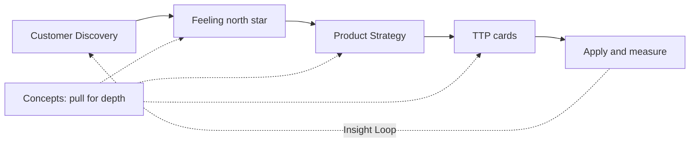
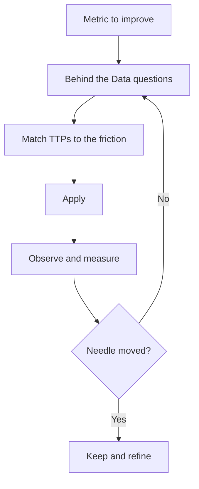

# The Product Feelings Handbook

Ditch guesswork. Get product-market fit.

## What’s Inside

**Welcome & Setup** (this page)

- [Introduction](#introduction)
- [How to use this handbook](#how-to-use-this-handbook)

**[Why it Works](why-it-works.md)** — the science and history behind emotionally aware product design.

**[Customer Discovery](discovery/index.md)** — the prerequisite: who the customer is, what state they arrive in, and how they work, talk, search, and buy.

**[Product Strategies](strategies/index.md)** — twelve strategies that combine TTPs toward a product goal.

**[Tools, Techniques, and Practices](ttps/index.md)** — thirty-seven modular TTPs you can combine, remix, or ignore.

**[Concepts (deep dives)](concepts/index.md)** — the ideas, definitions, and science the rest of the handbook builds on. Read for depth when a strategy or TTP cites them.

**[Continue learning](continue-learning.md)** — primary sources and durable libraries beyond this handbook.

## Introduction

The Product Feelings Handbook is a modular guide to designing how your product feels: clear, momentum-building, emotional, and intentional.

In consumer apps, users don’t just remember what your product does. They remember how it feels. That feeling is what turns first use into habit, and habit into loyalty.

Inside, you’ll find product strategies and Tools, Techniques, and Practices (TTPs): patterns you can combine, remix, or ignore to shape behaviour and deepen attachment. Use what fits your product, stage, and style.

Whether you're chasing product-market fit (PMF) or refining something that already works, this handbook helps you build apps people keep coming back to because of how they feel.

## How to use this handbook

Combine, remix, ignore. It’s a modular system designed to shape itself around your product, your stage, your style. Use what fits, drop what doesn’t.

There are **two ways to work with it**, and they share the same foundation:

- **With the ProductFeeling skill** — an AI agent runs the handbook for you through `/productfeeling` commands. Fastest path; the agent loads only the pages it needs.
- **Text only** — read and apply it by hand, deck-of-cards style. No tooling required.

Either way, emotional product design cannot succeed without knowing *whose* experience you are designing. Ground yourself first in [Customer Discovery](discovery/index.md) and the shared vocabulary in [Concepts (deep dives)](concepts/index.md)—especially the [Feeling North Star](concepts/01-feeling-north-star.md).

### Path A — With the ProductFeeling skill

The skill turns each activity below into a command. Install it (`npx skills add DecisionNerd/ProductFeeling`), then:

| To… | Run |
|------|-----|
| See everything you could do here | `/productfeeling library` |
| Capture the feeling north star in your docs | `/productfeeling init` |
| Ask how a surface or flow feels | `/productfeeling feel <target>` |
| Audit for completeness / method | `/productfeeling audit <target>` |
| Push a surface from good to great | `/productfeeling critique <target>` |
| Find a quick win at random | `/productfeeling random` |
| Run a strategy playbook end to end | `/productfeeling sequence <goal>` |
| Just keep improving it, no re-asking | `/productfeeling next` |
| Hand off to craft / docs | `/productfeeling brief` · `/productfeeling handoff` |

The agent pulls the relevant strategies, TTPs, and concept deep dives on demand—you don’t have to read the whole book first.

### Path B — Text only

No skill required. Work the deck by hand:

**Solve a larger goal**

1. Confirm who the customer and user are, their need state, and how they work today ([Customer Discovery](discovery/index.md)).
2. Name the [feeling north star](concepts/01-feeling-north-star.md) for the surface or journey.
3. Pick a [Product Strategy](strategies/index.md) that addresses your goal.
4. Gather the [TTP](ttps/index.md) cards the strategy names—and open the [Related concepts](concepts/index.md) those cards cite for depth.

**Audit your product**

1. Shuffle the deck; pick a [TTP](ttps/index.md) card at random.
2. Ask: could this apply to your product?
3. Use the “Make It Yours” prompts to adapt it.
4. Repeat three times to surface quick wins.

**Explore “Pair with” routes**

1. Follow the interlinked TTP cards.
2. Keep the ones that support your vision.
3. Combine and link them into your own holistic strategy.

**Run an Insight Loop**

1. Start with a metric you want to improve.
2. Use the “Behind the Data” questions to uncover what’s driving it.
3. Match findings to the TTPs that solve for that friction.
4. Apply, observe, and measure.
5. Return to the data—did the needle move? Reflect, adapt, and loop again.
